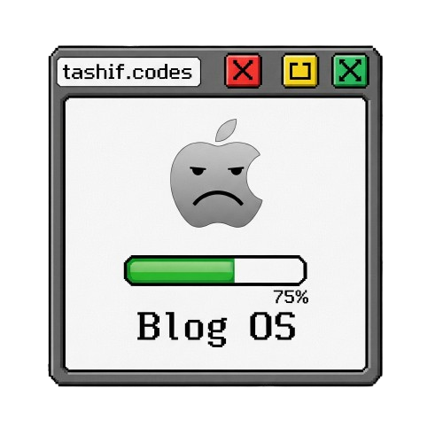

<h1 align="center"> BlogOS – A Themed Blog Website </h1>



**BlogOS** is a retro-inspired, multi-theme blog platform built with **Astro**, **React**, **TailwindCSS**, and **Framer Motion**.  
It mimics the look and feel of classic operating systems (Mac OS, Windows 95/XP, Ubuntu, NeoBrutalism, etc.) while providing a modern, responsive, and animated blogging experience.

---

## Tech Stack

      

---

## Features

- Multiple Built-in Themes:

  - Mac Classic (System 8/9)
  - Mac OS X Aqua
  - Modern macOS
  - Dark Mode macOS
  - Windows 95
  - Windows XP
  - Ubuntu
  - NeoBrutalism
  - Liquid Glass (both light & dark)

- OS-like UI Components:

  - Menu bar with dropdown menus
  - Windowed content areas with controls
  - Status bar with social icons

- Optimised Mobile Layout
- Reader Options
- Dynamic Likes, Comments and Views

## Getting Started

### 1. Clone the Repository

```bash
git clone https://github.com/yourusername/blogos.git
cd blogos
```

### 2. Install Dependencies

```bash
npm install
# or
yarn install
# or
pnpm install
```

### 3. Run the Development Server

```bash
npm run dev
```

Visit `http://localhost:4321` in your browser.

### 4. Build for Production

```bash
npm run build
```

Preview the production build:

```bash
npm run preview
```

## Writing Blog Posts

1. Create a new `.mdx` file in the `blogs/` directory.
2. Add frontmatter at the top:

```mdx
---
title: "My First Blog Post"
date: "2025-08-09"
excerpt: "A short description of my post."
tags: ["Astro", "React", "TailwindCSS"]
---

## Hello World

This is my first post in **BlogOS**!
```

3. The post will automatically appear in the blog list and search results.

## Customizing Themes

Themes are defined in `src/lib/theme-config.ts`.

To change the default theme:

```ts
export let activeTheme: ThemeConfig = macClassicTheme; // Change to your preferred theme
```

To add a new theme:

```ts
export const myTheme: ThemeConfig = {
  name: "myTheme",
  backgroundColor: "#fff",
  borderColor: "#000",
  textColor: "#000",
  accentColor: "#ff0000",
  // ... other properties
};

export const allThemes = {
  ...,
  myTheme
};
```

## API Routes

- `/api/posts.json` – Returns all blog posts with metadata (used for search & recent posts).
- `/api/like/[slug]`
- `/api/view/[slug]`
- `/api/comment/[slug]` - addes it in a form of a graph

---

## Roadmap

- [ ] Add drag-and-drop window positioning
- [ ] Add projects and all
- [ ] Add Leetcode Problems solved
- [x] Add more OS-inspired themes (e.g., Windows 7, macOS 26)
- [x] Add post categories & filtering
- [ ] Add RSS feed support
- [ ] Likes and Views
- [ ] Add comment system

---

## Contributing

1. Fork the repo
2. Create a new branch (`feature/my-feature`)
3. Commit your changes
4. Push to your branch
5. Open a Pull Request

---

## License

This project is licensed under the **GPL 3** – feel free to use and modify it.
