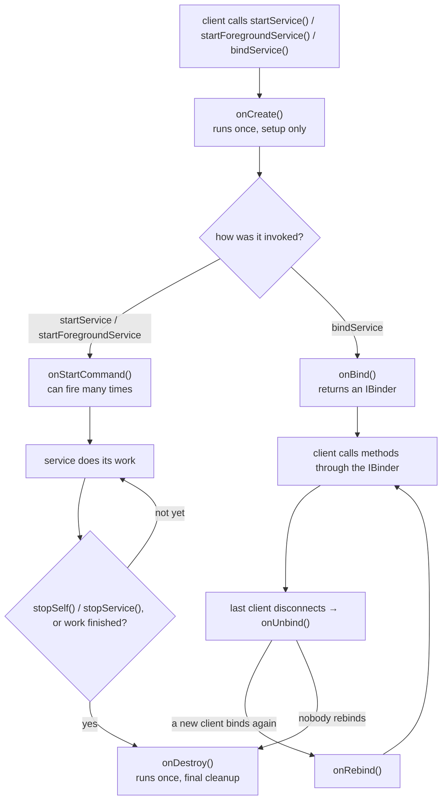

<Lede>
I was building a small run-tracking app, nothing fancy, just GPS updates every few seconds feeding a distance calculation. It worked perfectly in the emulator with the app in the foreground. Then I locked the phone to put it in my pocket for an actual test run, and thirty seconds later the updates just stopped. No crash, no error in Logcat, the location callback simply went quiet. I'd built the tracking loop as a plain background service, the kind you could start and forget on older Android, and the OS had quietly decided my app didn't get to run in the background like that anymore. That bug is basically a guided tour of everything a Service actually is, so here's the whole thing: what the three types are for, the lifecycle underneath all of them, and why Android 8 changed the rules on exactly the pattern I'd written.
</Lede>

<Toc />

<Figure caption="One Service instance can be started, bound, or both at once. The lifecycle branches depending on how a client talks to it, but onCreate and onDestroy always bookend everything.">

</Figure>

## what a service actually is

A Service is one of Android's four core component types, alongside Activities, Content Providers, and Broadcast Receivers, and its whole job is running work with no UI attached. That's the entire distinction from an Activity: no screen, no layout, just a component that keeps executing whether or not the user is looking at your app.

The detail that gets people, and got me: a Service runs on your app's main thread by default. It is not a background thread. Nothing about the word "service" implies "off the UI thread", it just means "no UI." Spotify keeping music playing while you switch apps, WhatsApp syncing messages, Google Maps tracking your route with the screen off, all of that is a Service, and none of it gets a free pass on doing heavy work on the main thread.

## the three types, and which problem each one solves

### foreground services: loud on purpose

A foreground service is the one that tells on itself. It runs with a persistent notification the entire time it's alive, by design, so the user always knows an app is actively doing something in the background. This isn't a nag screen you can suppress; it's the mechanism. Dismiss that notification and the service, along with whatever it was doing, dies with it.

<Warning>
If the user swipes away a foreground service's notification, the service and its work terminate immediately. There's no silent-survive mode here.
</Warning>

In exchange for that visibility, the system gives foreground services meaningfully higher priority than background work, which is exactly why music playback, turn-by-turn navigation, video calls, and fitness tracking all live here. Since Android 12 (API 31), you also have to declare *which kind* of foreground service you're running, both in the manifest and at runtime: `mediaPlayback`, `location`, `dataSync`, `phoneCall`, and a few others. That declaration isn't bureaucracy for its own sake, it's what lets the system reason about your service instead of treating all foreground work identically.

### background services: mostly gone, and for a good reason

This is the type that broke my run tracker, so let's be precise about it. A background service has no notification and, before Android 8 (API 26), no real limits either: you could start one and it would keep running indefinitely, screen off or not, app in the foreground or not. That flexibility is exactly what killed a lot of phones' battery life, apps piled background services on top of each other with nothing forcing restraint, and the aggregate effect was bad enough that Google closed the door on it.

On Android 8 and later, calling `startService()` to launch something that's going to run in the background throws an `IllegalStateException`, full stop, no exceptions for "but my use case is different." The only sanctioned way to run something in the background now is to make it a foreground service via `startForegroundService()`, which obligates you to call `startForeground()` with a notification within a few seconds or the system kills you anyway. My run tracker was doing neither, it was a plain started service quietly assuming Android 7 rules, and once the screen locked, the system had every right to reclaim it.

The honest fix, most of the time, isn't "make it a foreground service." It's "don't use a service for this at all." **WorkManager** is the actual recommended path for deferred, guaranteed background work, it survives a device reboot, understands constraints like "only on WiFi" or "only while charging", and is the right tool for periodic sync, uploads, and backups. **JobScheduler** covers the same territory at a lower level if you want fine-grained control over the scheduling conditions yourself.

### bound services: the two-way ones

A bound service exists for when a component, usually an Activity, needs an actual conversation with a service rather than a one-shot "go do this." Binding via `bindService()` hands the client an `IBinder`, and through that interface the client can call methods, ask for data, and get callbacks back, closer to a local API than a fire-and-forget command.

The canonical example is a media player: playback controls in a notification or a separate UI send "play," "pause," "skip" through the binder, and the service reports back playback state so the UI stays in sync. A service can also just be a facade over data another app wants to query, exposing a library's contents without handing out direct database access.

Nothing stops a single service from being both started and bound at once, which is normal, not a hack. A well-built music player service starts itself to keep audio playing in the background independent of any UI, and simultaneously accepts bind connections from whatever screen is currently showing playback controls. That hybrid path is exactly the branch in the diagram above where `onStartCommand()` and `onBind()` both get called on the same instance.

## the lifecycle, one callback at a time

`onCreate()` runs exactly once, right when the system stands the service up, and it's for setup: allocate resources, open connections, initialize whatever the service needs for its whole life. It blocks the main thread until it returns, so keep it fast, this is not where the actual long-running work happens.

`onStartCommand()` fires every time a client calls `startService()` or `startForegroundService()`, which can be many times over the service's life, unlike `onCreate()`. It receives the triggering `Intent` and returns an int that tells the system what to do if it has to kill the process under memory pressure:

<Panel title="START_NOT_STICKY" tone="muted">
Don't restart the service if it's killed, and don't redeliver the intent. Right for a one-off task that's fine being recreated fresh later if needed, nothing was lost by not resuming it exactly where it left off.
</Panel>

<Panel title="START_STICKY" tone="accent">
Recreate the service after a kill, but call `onStartCommand()` with a `null` intent rather than replaying the last one. This is the music-player, persistent-socket pattern: the service should exist and keep running, but doesn't need to remember exactly what it was told last time.
</Panel>

<Panel title="START_REDELIVER_INTENT" tone="ok">
Recreate the service *and* redeliver the last intent, so it can pick back up on the specific data it was working on. File uploads and data processing jobs want this, they need to know what they were doing, not just that they should keep existing.
</Panel>

`onBind()` fires when a client calls `bindService()` and returns the `IBinder` that client will use. If nothing ever binds to your service, this callback simply never runs, it's not on the mandatory path the way `onCreate()` and `onDestroy()` are. When the last bound client disconnects, `onUnbind()` gives you a chance to clean up or, per Android's design, decide whether the service should hang around; if a new client binds again afterward, `onRebind()` runs instead of a fresh `onBind()`.

`onDestroy()` is the last thing that happens, exactly once, and it's your only chance to release everything: close connections, stop threads, cancel coroutines, remove listeners. Anything left running past this point is a leak.

## why the rules changed, and what replaced the old pattern

Android 8's background limits weren't arbitrary. Before them, a phone with a handful of apps each quietly running an unrestricted background service would burn through battery and degrade noticeably, because nothing capped the aggregate cost of "every app gets to do whatever it wants when you're not looking." The fix is blunt but effective: `startService()` for background work throws on API 26+, no gray area, and the only door left open is `startForegroundService()` with its mandatory, user-visible notification.

That leaves three real options once you're past the "just use a background service" instinct:

**WorkManager** for anything deferred and guaranteed: it survives reboots, respects battery saver and Doze, and understands constraints like network type or charging state without you writing that logic yourself. This is what my run tracker's periodic sync should have used, though obviously not the live GPS loop, which needs to run *now*, continuously, which is a foreground-service job.

**JobScheduler** if you want scheduling control below WorkManager's abstraction, still constraint-aware, still respecting the same battery rules.

**Foreground services** for exactly the thing they're built for: work that has to happen immediately and continuously, and where a persistent notification is an honest, not an annoying, disclosure to the user. My run tracker's actual fix was here, wrap the GPS loop in a foreground service declared with the `location` type, show a "tracking your run" notification, and the OS stops treating it as background work to reclaim.

## a few things that will bite you regardless of which type you pick

Offload real work off the main thread. A service running heavy computation, file I/O, or network calls directly in a callback will produce the same ANR you'd get from blocking an Activity's UI thread, "it's a service" buys you nothing here. Coroutines, a thread pool, or RxJava if you're already using it, any of them beat blocking inline.

<Danger title="services run on the main thread by default">
There is no implicit background thread. If your `onStartCommand()` does anything slow directly, you will ANR exactly like a slow `onClick()` would.
</Danger>

Start services with explicit intents. An implicit intent lets any component that matches handle it, which for a service means potentially handing your startup command to something you didn't intend. Naming the exact class you want closes that off.

Set `android:exported="false"` in the manifest for any service that isn't meant to be called from outside your app, and only flip it to `true`, with permission checks in the service itself, when you actually mean for other apps to reach it.

Declare foreground service types honestly. `mediaPlayback`, `location`, `dataSync`, `phoneCall`, `fitness`, `shortService`, each one is a signal to the system about what kind of resource guarantee you need and a signal to the user about why a notification is sitting in their tray.

## the decision guide

<Checklist title="pick the right tool, not just \"a service\"">
- [ ] Music, navigation, an active call, or anything the user explicitly expects to keep running with the screen off → **foreground service**, with the correct declared type
- [ ] Periodic sync, backups, or any deferred work that should survive a reboot → **WorkManager**
- [ ] Scheduled work where you want direct control over the trigger constraints → **JobScheduler**
- [ ] A UI component needs to call methods on and get callbacks from a long-lived component → **bound service**
- [ ] A service needs to run independently *and* let a UI talk to it → **hybrid**, started and bound on the same instance
- [ ] Anything that used to be a plain background service on Android 7 → it isn't anymore, pick one of the above
</Checklist>

**Bottom line:** a Service is not a background thread, and "background service" as a freestanding pattern hasn't really existed since Android 8, `IllegalStateException` will tell you so the moment you try. Foreground services buy you priority in exchange for an honest, persistent notification; bound services buy you a real two-way channel through an `IBinder`; and for everything else, WorkManager and JobScheduler already do the constraint-handling you'd otherwise have to write yourself. My run tracker works now because the GPS loop lives in a foreground service with the `location` type declared, and the periodic upload of completed runs went to WorkManager instead, which is really just picking the tool that matches what the work actually needs, not what used to be the path of least resistance.

Go pick the right one before the OS picks it for you.
