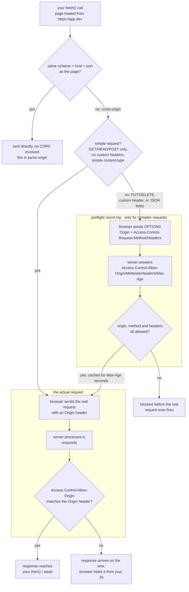

<Lede>
My frontend was on <code>:5173</code>, my API was on <code>:8000</code>, and the first real <code>fetch</code> call I wrote against my own backend died in the console with a wall of red. <code>Access to fetch at 'http://localhost:8000/data' from origin 'http://localhost:5173' has been blocked by CORS policy.</code> Same laptop, same me, and it had worked fine in Postman thirty seconds earlier. I didn't understand what was being blocked, or who was doing the blocking, or why my own two servers were suddenly strangers. Turns out it's the browser, on purpose, and once you see the actual shape of the mechanism, every future CORS error turns into a five-second fix instead of a fifteen-minute panic.
</Lede>

This is the version of that explanation I wish I'd had. What an origin actually is, why the browser refuses cross-origin reads by default, and then, roughly in the order you'll hit them, every real way CORS breaks your code afterward: the preflight you didn't know was happening, the credentials that need an exact origin, the wildcard that turns illegal the moment a cookie shows up.

<Toc />

## the whole request, start to finish

Before the individual pieces, here's the shape of the whole thing. Every CORS error you'll ever see is just one node in this graph turning red instead of green.

<Figure caption="What the browser actually does between your fetch() call and your .then(): a same-origin check, a branch for whether the request is 'simple,' an optional preflight round trip, and a final check on the way back before your JS is allowed to see the response.">



</Figure>

Two things worth noticing before we go section by section. First, same-origin requests skip all of this; CORS only exists for the cross-origin branch. Second, and this trips people up constantly: the "actual request" box runs even when the answer is going to be "blocked." The browser sends it, the server processes it, and only then does the browser decide whether your JavaScript is allowed to see what came back. More on why that distinction matters in a minute, because it changes what CORS is and isn't protecting you from.

## origins: what actually counts as "different"

An origin is the combination of scheme, host and port, nothing else. `https://yoursite.dev:443` breaks down to scheme `https`, host `yoursite.dev`, port `443`. The path is not part of it, so these three are all the same origin:

```
https://yoursite.dev/home
https://yoursite.dev/api/users
https://yoursite.dev/dashboard/settings
```

Change any one of the three fields and it's a different origin, even if it looks like the "same site" to a human:

```
https://yoursite.dev:443        ← origin 1
https://api.yoursite.dev:443    ← origin 2, different host (subdomain)
http://yoursite.dev:443         ← origin 3, different scheme
https://yoursite.dev:8080       ← origin 4, different port
```

That subdomain one is the case that catches everyone, man. `api.yoursite.dev` feels like it should count as "yours," but the browser doesn't care about ownership, only about the tuple. This is the whole reason CORS needs to exist at all: the browser's default answer to "can this origin read that origin's response" is no, full stop, even when both origins belong to the same person.

## same-origin policy: the default, and the problem it creates

The same-origin policy is what the browser does before you've configured anything: a page loaded from one origin cannot read the response of a request made to a different origin. Not "cannot send the request," specifically "cannot read what comes back." MDN's phrasing is close to exact: a script can only request resources from the origin it was loaded from, and reads from anywhere else get withheld.

Here's why that default exists. Say there were no such restriction. You've got your bank open in one tab, logged in, cookies set. In another tab you open some link a friend sent you, and that page runs:

```javascript
fetch("https://yourbank.com/api/balance", { credentials: "include" })
	.then((response) => response.json())
	.then((balance) => sendToAttackerServer(balance));
```

Without the same-origin policy, that fetch call reads your balance and ships it off to someone else's server, silently, while you're looking at a page about recipe blogs. That's the entire threat model in one function. Any tab, any origin, could reach into any other origin you happen to be logged into and read whatever it wanted.

<Note title="CORS blocks reading, not sending">
This is the part that's easy to miss and it matters: the same-origin policy and CORS stop your JavaScript from <em>reading</em> a cross-origin response. They do not stop the browser from sending the request, and they don't stop the server from acting on it. For a "simple" request (a plain GET, or a POST with a form-style body), the request goes out, the server does whatever it does, and only then does the browser decide whether to hand the response to your script. So if a server has a state-changing endpoint sitting behind a simple request with no other protection, CORS alone won't save it; a forged request can still fire and still execute, your JS on the attacking page just won't get to read the reply. That's a CSRF problem, and it needs its own defense (SameSite cookies, CSRF tokens), separate from CORS. CORS is a confidentiality control on reads, not a general request firewall.
</Note>

The same restriction that blocks the attacker also blocks you from yourself. If your frontend lives on `yoursite.dev` and your API lives on `api.yoursite.dev` for perfectly sane architectural reasons, they're different origins by the same rule, and your own frontend can't read its own API's responses. CORS is the server-side opt-in that lets you say "actually, I do trust this specific origin," without turning the same-origin policy off for everyone else.

## challenge 0: the plain GET that just works, until it doesn't

Start with the simplest possible case, because it's the one that reveals the whole mechanism. Your frontend on `:5173` calls your API on `:8000`:

```javascript
fetch("http://localhost:8000/data");
```

The browser tags this as cross-origin and adds an `Origin` header automatically, you never write this yourself:

```
GET /data HTTP/1.1
Host: localhost:8000
Origin: http://localhost:5173
```

The server sees the request, sees the origin, and has to make a decision: trust it or don't. Here's an Express route that hasn't made that decision at all:

```javascript
app.get("/data", (req, res) => {
	res.json({ message: "Hello from server!" });
});
```

The response comes back with no CORS header whatsoever, and the browser refuses to hand it to your JS:

```
Access to fetch at 'http://localhost:8000/data' from origin 'http://localhost:5173'
has been blocked by CORS policy: No 'Access-Control-Allow-Origin' header is present
on the requested resource.
```

Check the Network tab and you'll see the request went out fine, the server actually responded (status 200, a body, all of it), and the browser is the one holding it back:

```
Content-Type: application/json
Content-Length: 67
# no Access-Control-Allow-Origin header at all
```

The fix is one line, and it's the entire mechanism in miniature: tell the server which origin to trust, and echo that trust back in a header.

```javascript
app.get("/data", (req, res) => {
	res.setHeader("Access-Control-Allow-Origin", "http://localhost:5173");
	res.json({ message: "Hello from server!" });
});
```

Restart, retry, and it works, because now the response carries the one header the browser was waiting for:

```
Access-Control-Allow-Origin: http://localhost:5173
Content-Type: application/json
```

A few things worth internalizing from this smallest possible example, because they hold for everything below it. The server decides who's trusted, never the client. The value has to match the requesting origin exactly, scheme, host and port, or the browser rejects it even if the header is present. And the decision is per-route: nothing stops you from allowing `/public-data` and locking down `/user/profile` in the same app, which is honestly the whole trick, yk.

## challenge 1: the POST that suddenly triggers a preflight

The GET above went out and came back in one round trip. Change it to a POST with a JSON body, and something new happens before your request even reaches the server:

```javascript
fetch("http://localhost:8000/users", {
	method: "POST",
	headers: { "Content-Type": "application/json" },
	body: JSON.stringify({ name: "New User" }),
});
```

This is the difference between a "simple" request and a "complex" one, and it's not about the method alone:

<Cols>
<Col>

**Simple** (sent directly, no preflight)

Only `GET`, `HEAD` or `POST`. No custom headers. Content-Type limited to `application/x-www-form-urlencoded`, `multipart/form-data`, or `text/plain`.

</Col>
<Col>

**Complex** (preflight required first)

Anything else: `PUT`, `PATCH`, `DELETE`, a `Content-Type: application/json`, or a custom header like `Authorization` or `X-API-Key`.

</Col>
</Cols>

For a complex request, the browser sends a preflight before your actual request goes anywhere:

<Steps>
<Step title="Browser sends OPTIONS, not your request">

```
OPTIONS /users/123 HTTP/1.1
Host: localhost:8000
Origin: http://localhost:3000
Access-Control-Request-Method: DELETE
Access-Control-Request-Headers: authorization
```

It's asking, on your behalf and before committing to anything: if I actually sent this DELETE with this Authorization header, would you accept it?

</Step>
<Step title="Server has to answer that exact question">

```javascript
app.options("/users/:id", (req, res) => {
	res.setHeader("Access-Control-Allow-Origin", "http://localhost:3000");
	res.setHeader("Access-Control-Allow-Methods", "GET, POST, PUT, DELETE");
	res.setHeader("Access-Control-Allow-Headers", "Content-Type, Authorization");
	res.setHeader("Access-Control-Max-Age", "86400");
	res.sendStatus(200);
});
```

</Step>
<Step title="Only now does the real request go out">

```
DELETE /users/123 HTTP/1.1
Host: localhost:8000
Origin: http://localhost:3000
Authorization: Bearer token123
```

</Step>
</Steps>

Wire this up for a whole resource and it looks like this: one `OPTIONS` handler covering the routes, then the routes themselves each set `Access-Control-Allow-Origin` on their own response, because the preflight answer and the actual response are two separate messages that both need the header.

```javascript
app.options("*", (req, res) => {
	res.setHeader("Access-Control-Allow-Origin", "http://localhost:3000");
	res.setHeader(
		"Access-Control-Allow-Methods",
		"GET, POST, PUT, PATCH, DELETE, OPTIONS"
	);
	res.setHeader(
		"Access-Control-Allow-Headers",
		"Content-Type, Authorization, X-Requested-With"
	);
	res.setHeader("Access-Control-Max-Age", "86400");
	res.sendStatus(200);
});

app.get("/users", (req, res) => {
	res.setHeader("Access-Control-Allow-Origin", "http://localhost:3000");
	res.json([{ id: 1, name: "John" }]);
});

app.post("/users", (req, res) => {
	res.setHeader("Access-Control-Allow-Origin", "http://localhost:3000");
	res.status(201).json({ id: 3, ...req.body });
});

app.delete("/users/:id", (req, res) => {
	res.setHeader("Access-Control-Allow-Origin", "http://localhost:3000");
	res.sendStatus(204);
});
```

Any of these three from the client will trip the preflight: the `DELETE`, the `POST` with `Content-Type: application/json`, or a plain `GET` carrying an `Authorization` header. Same mechanism, three different reasons to trigger it.

<Tip title="Skip the preflight entirely, if the payload allows it">
If your body genuinely doesn't need JSON, sending it as <code>FormData</code> instead keeps the request "simple" and skips the OPTIONS round trip completely. Not always practical, but worth knowing it's an option when you're chasing latency on a hot path.
</Tip>

## challenge 2: cookies need permission on both sides

Everything so far has been anonymous. Add authentication and CORS gets a second layer of rules, because now there's something worth stealing.

"Credentials" here means cookies, `Authorization` headers, and client-side certificates. By default, a cross-origin fetch sends none of them, you have to ask explicitly:

```javascript
fetch("http://localhost:8000/protected-data", {
	credentials: "include",
});
```

And the server's requirements get stricter to match. A wildcard origin is no longer good enough; it has to be the one specific origin, plus an explicit statement that credentials are allowed:

```javascript
app.get("/protected-data", (req, res) => {
	res.setHeader("Access-Control-Allow-Origin", "http://localhost:3000");
	res.setHeader("Access-Control-Allow-Credentials", "true");
	res.json({ sensitiveData: "only for authenticated users" });
});
```

This is exactly the restriction that keeps the bank example from earlier from working even if an attacker does explicitly ask for credentials. The attacker's page can set `credentials: "include"` all it wants; unless the bank's server responds with that attacker's exact origin in `Access-Control-Allow-Origin` (which it obviously won't), the browser withholds the response. The server has to consciously name the origin it trusts with authenticated data, and a blanket "everyone" is off the table the moment credentials enter the picture, which is really the whole point of the next challenge.

A login flow end to end, condensed:

```javascript
app.post("/login", (req, res) => {
	const { username, password } = req.body;
	if (username === "user" && password === "pass") {
		req.session.userId = "user123";
		res.setHeader("Access-Control-Allow-Origin", "http://localhost:3000");
		res.setHeader("Access-Control-Allow-Credentials", "true");
		res.json({ success: true });
	} else {
		res.status(401).json({ error: "Invalid credentials" });
	}
});

app.get("/user/profile", (req, res) => {
	if (!req.session.userId) return res.status(401).json({ error: "Not authenticated" });
	res.setHeader("Access-Control-Allow-Origin", "http://localhost:3000");
	res.setHeader("Access-Control-Allow-Credentials", "true");
	res.json({ userId: req.session.userId });
});
```

```javascript
fetch("http://localhost:8000/login", {
	method: "POST",
	credentials: "include",
	headers: { "Content-Type": "application/json" },
	body: JSON.stringify({ username: "user", password: "pass" }),
});

fetch("http://localhost:8000/user/profile", { credentials: "include" })
	.then((r) => r.json())
	.then((profile) => console.log(profile));
```

## challenge 3: wildcard plus credentials is not allowed, full stop

<Danger title="This isn't a bad practice, it's a browser error">
The moment a request sets <code>credentials: "include"</code>, a response with <code>Access-Control-Allow-Origin: *</code> stops being valid. Not discouraged, invalid. The browser throws it out regardless of what the rest of the response says.
</Danger>

```
Access to fetch at 'http://localhost:8000/api/profile' from origin 'http://localhost:3000'
has been blocked by CORS policy: The value of the 'Access-Control-Allow-Origin' header
in the response must not be the wildcard '*' when the request's credentials mode is 'include'.
```

The reason the spec forbids it is straightforward once you say it out loud: `*` means "I trust everyone," and "everyone" combined with "here are the user's cookies" means any site on the internet could read authenticated data from any user who happens to have it open in another tab. So the fix isn't a workaround, it's just doing what challenge 2 already showed: name the exact origin.

```javascript
// rejected outright once credentials are involved
res.setHeader("Access-Control-Allow-Origin", "*");

// works
res.setHeader("Access-Control-Allow-Origin", "http://localhost:3000");
res.setHeader("Access-Control-Allow-Credentials", "true");
```

Wildcards are genuinely fine, even correct, when there's nothing personal on the other end of the response: a public weather endpoint, a CDN serving static assets, a widget meant to be embedded anywhere.

```javascript
app.get("/api/weather/:city", (req, res) => {
	res.setHeader("Access-Control-Allow-Origin", "*");
	res.json({ city: req.params.city, temperature: "25°C" });
});
```

The rule of thumb that actually holds: wildcard for public data with no session behind it, exact origin the instant a cookie or bearer token enters the request.

## challenge 4: custom headers need to be on the list too

Send a header the server hasn't explicitly named, and the preflight rejects it before your actual request goes anywhere:

```
Access to fetch at 'http://localhost:8000/api/data' from origin 'http://localhost:3000'
has been blocked by CORS policy: Request header field x-api-key is not allowed by
Access-Control-Allow-Headers in preflight response.
```

The fix is the same shape as everything else in this post: the server has to name it.

```javascript
app.options("*", (req, res) => {
	res.setHeader("Access-Control-Allow-Origin", "http://localhost:3000");
	res.setHeader(
		"Access-Control-Allow-Headers",
		"Content-Type, Authorization, X-API-Key, X-Custom-Header"
	);
	res.sendStatus(200);
});
```

```javascript
fetch("http://localhost:8000/api/data", {
	headers: { "X-API-Key": "your-api-key", "Content-Type": "application/json" },
});
```

## challenge 5: preflight caching, and the stale-cache trap

Preflight adds a round trip to every complex request, which is worth avoiding when you can. `Access-Control-Max-Age` tells the browser how long, in seconds, it can skip re-asking and just remember the answer:

```javascript
res.setHeader("Access-Control-Max-Age", "86400"); // cache the preflight for a day
```

Which is great, until you change your CORS config and wonder why the old error is still showing up. The browser is doing exactly what you told it to: it cached yesterday's answer and won't check again until the cache expires. In development this is just annoying, so set it to zero while you're actively iterating:

```javascript
app.options("*", (req, res) => {
	res.setHeader("Access-Control-Allow-Origin", "http://localhost:3000");
	res.setHeader("Access-Control-Max-Age", "0");
	res.sendStatus(200);
});
```

Or clear it manually: Chrome DevTools → Application → Storage → Clear storage, Firefox DevTools → Storage → Clear All. Set it back to a real number, 86400 is a common choice, once you ship, so production traffic isn't preflighting on every single request.

## challenge 6: it works in dev, breaks in prod (or on a different port)

```
Access to fetch at 'http://localhost:8000/api/data' from origin 'http://localhost:3001'
has been blocked by CORS policy: the resource's CORS header 'Access-Control-Allow-Origin'
is 'http://localhost:3000'.
```

Your frontend moved ports, or you deployed, and the string you hardcoded into `Access-Control-Allow-Origin` no longer matches. Fair, it's an easy one to forget. The straightforward fix is a list instead of a string:

```javascript
const allowedOrigins = [
	"http://localhost:3000",
	"http://localhost:3001",
	"https://yourapp.com",
];

app.use(
	cors({
		origin: function (origin, callback) {
			if (!origin || allowedOrigins.includes(origin)) {
				return callback(null, true);
			}
			callback(new Error("Not allowed by CORS"));
		},
		credentials: true,
	})
);
```

And for anything with dynamic subdomains, a pattern instead of a fixed list, still scoped tightly rather than opened up:

```javascript
const isValidOrigin = (origin) => {
	if (process.env.NODE_ENV === "development") {
		return /^http:\/\/localhost:\d+$/.test(origin);
	}
	const allowedPatterns = [
		/^https:\/\/[\w-]+\.yourapp\.com$/, // subdomains
		/^https:\/\/yourapp\.com$/,
	];
	return allowedPatterns.some((pattern) => pattern.test(origin));
};

const corsConfig =
	process.env.NODE_ENV === "production"
		? { origin: ["https://yourapp.com", "https://www.yourapp.com"], maxAge: 86400 }
		: { origin: /^http:\/\/localhost:\d+$/, maxAge: 0 };

app.use(cors({ ...corsConfig, credentials: true }));
```

The pattern to notice: every environment mismatch above traces back to the same root cause as the very first error in this post. A string that doesn't exactly match the requesting origin. Regex and lists just make "exactly match" cover more than one string at a time.

## why postman never had this problem

<Important title="Why does my API work in Postman but fail in the browser?">
Because CORS is enforced by browsers, specifically, and nothing else.
</Important>

Postman, curl, HTTPie, a Node script using axios, a mobile app, none of them enforce it. Not because they're less secure, but because the threat model doesn't apply to them. A browser tab is a shared environment: half a dozen origins open at once, each with its own cookies and tokens, and any one of them could be running arbitrary JavaScript that tries to read the others. A `curl` command run from your terminal has none of that; it's one process, making one request, with no other origin's stolen session sitting around to leak.

```bash
curl -X GET "http://localhost:8000/data"
```

That works with zero CORS headers, no configuration, nothing. The exact same endpoint from a browser tab:

```javascript
fetch("http://localhost:8000/data")
	.then((r) => r.json())
	.then((data) => console.log(data));
// blocked by CORS policy
```

And a server calling another server has the same story as curl: no tabs, no stored cross-site cookies, nothing for CORS to protect.

```javascript
const response = await axios.get("http://other-server:8000/data"); // works fine, no CORS involved
```

This single distinction explains most of the "works everywhere except the browser" confusion: backend developers rarely see CORS errors during their own testing, because their own testing tools don't enforce the restriction their frontend colleagues are stuck debugging.

## wiring it up for real

Past a certain point you stop hand-rolling headers and reach for the `cors` middleware, which is fine, it's the same mechanism with less typing. The one thing worth doing deliberately: start from an explicit allowlist rather than opening everything and locking down later.

```javascript
const cors = require("cors");

const corsOptions = {
	origin: function (origin, callback) {
		if (!origin) return callback(null, true); // mobile apps, curl, Postman
		const allowedOrigins = ["https://yourapp.com", "https://admin.yourapp.com"];
		if (allowedOrigins.includes(origin)) return callback(null, true);
		callback(new Error("Not allowed by CORS"));
	},
	credentials: true,
	methods: ["GET", "POST", "PUT", "DELETE", "PATCH"],
	allowedHeaders: ["Origin", "X-Requested-With", "Content-Type", "Accept", "Authorization"],
};

app.use(cors(corsOptions));
```

If you'd rather not pull in a dependency, the manual version is the same handful of headers plus one branch for `OPTIONS`:

```javascript
const allowedOrigins = ["https://yourapp.com"];

app.use((req, res, next) => {
	const origin = req.headers.origin;
	if (allowedOrigins.includes(origin)) {
		res.setHeader("Access-Control-Allow-Origin", origin);
	}
	res.setHeader("Access-Control-Allow-Credentials", "true");
	res.setHeader("Access-Control-Allow-Methods", "GET, POST, PUT, DELETE, PATCH, OPTIONS");
	res.setHeader("Access-Control-Allow-Headers", "Content-Type, Authorization, X-Requested-With");
	if (req.method === "OPTIONS") {
		res.setHeader("Access-Control-Max-Age", "86400");
		return res.sendStatus(200);
	}
	next();
});
```

You don't have to apply the same policy everywhere either. Public endpoints can stay wide open, protected ones stay locked to your real frontend, in the same app:

```javascript
app.get("/api/public/*", cors({ origin: "*" }), publicRoutes);

app.use(
	"/api/protected/*",
	cors({ origin: "https://yourapp.com", credentials: true }),
	authMiddleware,
	protectedRoutes
);
```

And it's worth logging what gets rejected, if only so a genuine CORS misconfiguration doesn't look identical to an attempted attack in your logs six months from now:

```javascript
origin: function (origin, callback) {
	const allowedOrigins = ["https://yourapp.com"];
	if (!origin || allowedOrigins.includes(origin)) return callback(null, true);
	console.warn(`CORS blocked request from origin: ${origin}`, {
		timestamp: new Date().toISOString(),
	});
	callback(new Error("Not allowed by CORS"));
},
```

## testing it before your users find the gaps

A CORS misconfiguration is exactly the kind of bug that a `200 OK` assertion in your test suite will happily miss, since the status code is fine, it's the header that's wrong. Assert the header directly:

```javascript
const request = require("supertest");
const app = require("../server");

describe("CORS configuration", () => {
	test("allows the real frontend origin", async () => {
		const response = await request(app).get("/api/data").set("Origin", "https://yourapp.com");
		expect(response.headers["access-control-allow-origin"]).toBe("https://yourapp.com");
	});

	test("rejects an origin that isn't on the list", async () => {
		const response = await request(app).get("/api/data").set("Origin", "https://malicious.com");
		expect(response.headers["access-control-allow-origin"]).toBeUndefined();
	});

	test("handles a preflight for a complex method", async () => {
		const response = await request(app)
			.options("/api/data")
			.set("Origin", "https://yourapp.com")
			.set("Access-Control-Request-Method", "POST");
		expect(response.status).toBe(200);
		expect(response.headers["access-control-allow-methods"]).toContain("POST");
	});
});
```

Worth running through by hand too, once, in the actual browser: a simple GET, a POST with a JSON body, a credentialed request, a request carrying a custom header. Those four cover every challenge in this post, and any one failing tells you exactly which section to go back to.

## the checklist

<Checklist title="Before this CORS config goes anywhere near production">
- [ ] Start from an explicit origin allowlist, never a bare wildcard, unless the data is genuinely public
- [ ] Only add credentials handling when you actually need cookies or an Authorization header
- [ ] Never combine `Access-Control-Allow-Origin: *` with `Access-Control-Allow-Credentials: true`, the browser will reject it anyway
- [ ] Handle `OPTIONS` on every route that can receive a complex request: custom headers, JSON bodies, PUT/PATCH/DELETE
- [ ] Set `Access-Control-Max-Age` for production, but expect a stale cached preflight the moment you change the config in dev
- [ ] Keep dev and prod origins as separate, explicit lists or patterns instead of guessing which one is active
- [ ] Assert the actual header value in at least one automated test, the status code alone won't catch this
</Checklist>

**Bottom line:** CORS is not the browser being difficult for no reason, it's the one thing standing between "any tab you have open" and "any other tab you have open reading its cookies." The mechanism is small: an `Origin` header on the way out, an `Access-Control-Allow-Origin` on the way back, an optional `OPTIONS` round trip when the request is complex enough to need one, and a hard line the moment credentials and wildcards try to share a sentence. Every error message you'll hit is one of those four pieces not lining up, and now you know which one.

Next time the console goes red with "blocked by CORS policy," you'll know exactly which of these it is before you've even opened the Network tab.
