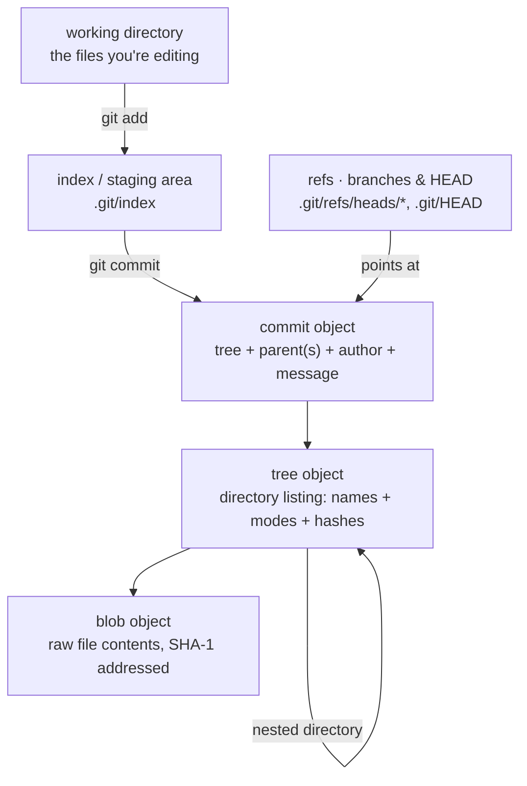

<Lede>
A few months back I was cleaning up commits before opening a PR. Ran `git rebase -i HEAD~12`, fat-fingered a `drop` on the wrong line, and watched an entire feature vanish from `git log`. My stomach actually dropped for a second. Then I remembered something: git doesn't delete anything the moment you think it does. `git reflog`, find the orphaned commit, `git cherry-pick` it back into existence, done. Five minutes, no data lost. That's the moment git internals stopped being trivia for me and started being the thing that saves my ass.
</Lede>

The reason reflog could save me is the same reason git is cheap to branch on and mostly safe to experiment with: it never edits anything in place. It writes new immutable objects and moves lightweight pointers around. Everything else, branches, merges, rebases, is a variation on that one trick. Here's the whole shape of it:

<Figure caption="Git's object pipeline: files become blobs, directories become trees, commits point at a tree plus their parent(s), and refs (branches, HEAD) are just movable pointers into this graph.">

</Figure>

<Toc />

## objects: the immutable building blocks

Under the hood, git is a content-addressable database of four object types, each named by the SHA-1 hash of its own content. Change one bit anywhere in an object and its hash changes, which is exactly why tampering or corruption shows up immediately instead of quietly.

<Panel title="blob" tone="accent">
A blob is the exact bytes of one file, nothing else. No filename, no path, no permissions, just content. Two files with identical contents anywhere in your repo, even in totally different directories, are the same blob. Git only ever stores that content once.
</Panel>

<Panel title="tree" tone="accent">
A tree is a directory listing. It points at a set of blobs and other trees, each with a name, a file mode, and a hash. When git nests a subdirectory, that's just a tree pointing at another tree. Walk a commit's tree recursively and you've reconstructed the entire project at that snapshot.
</Panel>

<Panel title="commit" tone="accent">
A commit points at exactly one tree, the complete state of the project at that moment, plus the author, the committer, a message, and one or more parent commits. That last part is what makes history a graph rather than a list: a normal commit has one parent, the first commit in a repo has zero, and a merge commit has two.
</Panel>

<Panel title="tag (annotated)" tone="accent">
A lightweight tag is nothing more than a ref, a name pointing at a commit. An annotated tag is an actual object: it stores the tagger, a date, a message, and a pointer to the commit it marks. That's the difference between "someone typed a label" and "there's a signed, dated record of a release."
</Panel>

## refs: pointers into that graph

Objects are immutable, but you need something that moves. That's what refs are: plain files under `.git/refs` holding a commit's SHA-1.

A branch, `main`, `feature-x`, whatever, is a lightweight, movable pointer to a commit. Commit on that branch and the pointer walks forward to the new commit automatically. `HEAD` is the special one: it's a symbolic ref pointing at whichever branch you currently have checked out. Run `git checkout feature-x` and `HEAD` now points at `refs/heads/feature-x`; commit, and the branch `HEAD` points to moves forward with it.

## branching is just a pointer copy

Given that model, branching is almost embarrassingly cheap. When you run `git branch new-feature`:

<Steps>
<Step>Git looks at the commit your current `HEAD` points to.</Step>
<Step>It writes a new file, `refs/heads/new-feature`, holding that exact same commit hash.</Step>
</Steps>

That's the entire operation. No file copying, no snapshotting a second time, just a new pointer sitting next to an existing one. When you then `git checkout new-feature`, git moves `HEAD` to point at that ref and rewrites your working directory to match the commit it names.

<Ascii label="Commit graph with main at C and new-feature diverging at D and E, with HEAD on new-feature">
      A -- B -- C (main)
           ^
           |
           D -- E (new-feature)
           ^
           |
          HEAD (after checkout new-feature)
</Ascii>

As you keep committing on `new-feature`, its pointer keeps moving forward while `main` sits still at its last commit. That's the whole mechanism behind branches diverging: two pointers walking away from each other over the same object graph.

## merging: joining two histories

Eventually those diverged lines need to come back together, and git handles that one of two ways depending on shape.

### fast-forward merge

If `main` hasn't moved since `feature-x` branched off it, `main` is literally an ancestor of `feature-x`. There's nothing to reconcile. Git just slides the `main` pointer forward to wherever `feature-x` is. No new commit gets created, because none is needed.

<Ascii label="Fast-forward merge: main moves from B forward to D, the tip of feature-x">
      A -- B (main)
            \
             C -- D (feature-x)

      # git checkout main
      # git merge feature-x

      A -- B -- C -- D (main, feature-x)
</Ascii>

### three-way merge

If both branches have moved since they diverged, git can't just slide a pointer. It has to actually reconcile two different sets of changes.

<Steps>
<Step>Find the common ancestor commit of the two branches.</Step>
<Step>Work out what changed on the target branch since that ancestor.</Step>
<Step>Work out what changed on the source branch since that ancestor.</Step>
<Step>Try to combine both sets of changes.</Step>
<Step>Write a new merge commit with two parents, the tips of both branches, and a tree representing the combined result.</Step>
</Steps>

<Ascii label="Three-way merge: diverged histories on main and feature-x joined by a new merge commit M with two parents">
      A -- B -- C (main)
            \      \
             D -- E -- M (merge commit)
                     /
                   F -- G (feature-x)

      # git checkout main
      # git merge feature-x
</Ascii>

<Warning title="conflict resolution">
When git can't automatically combine two changes to the same lines, it stops and marks a merge conflict instead of guessing. You resolve it by hand in the affected files, `git add` the result, and commit. There's no silent "pick one side" behavior, which is exactly what you want from something managing your entire history.
</Warning>

## rebasing: replaying commits instead of merging them

Rebase solves the same problem, diverged branches, differently. Instead of creating a merge commit that records both parents, it rewrites your branch's history so it looks like it started later than it did.

Running `git rebase main` from `feature-x` does this:

<Steps>
<Step>Find the common ancestor of `feature-x` and `main`.</Step>
<Step>Collect every commit on `feature-x` that isn't on `main` yet, and set them aside.</Step>
<Step>Rewind `feature-x` back to that common ancestor.</Step>
<Step>Move the `feature-x` pointer to the tip of `main`.</Step>
<Step>Replay the saved commits one by one on top of that new base. Each replayed commit is a brand-new commit object with a new SHA-1.</Step>
</Steps>

<Ascii label="Rebase: commits D and E are replayed onto C as new commits D-prime and E-prime">
      A -- B -- C (main)
            \
             D -- E (feature-x)

      # git checkout feature-x
      # git rebase main

      A -- B -- C -- D' -- E' (feature-x)
                  ^
                  |
                 (main)
</Ascii>

`D'` and `E'` carry the same diffs as `D` and `E`, but their parent is now `C` instead of `B`. Different parent means different hash, full stop, even though nothing about the actual code changed.

That's exactly the mechanism that ate my feature branch at the start of this post. `drop` in an interactive rebase just means "don't replay this one," and the original commit object doesn't stop existing, it just stops being reachable from any ref. `git reflog` still remembers where `HEAD` pointed a moment ago, which is how I got it back.

<Cols cols={2}>
<Col>

**merge**

Preserves history exactly as it happened. Creates a merge commit that shows the divergence and the join. Good default for landing feature branches into a shared branch you don't control alone.

</Col>
<Col>

**rebase**

Rewrites commits onto a new base so history reads as a straight line. Good for tidying up your own branch before it's ever shared. No merge-commit noise, but the commits are literally different objects afterward.

</Col>
</Cols>

<Danger title="never rebase shared history">
Don't rebase commits that have already been pushed and that someone else might have pulled. Rebase creates new commit objects, so anyone whose work is based on the old ones now has a branch that's diverged from a history that technically no longer exists upstream. Their next pull turns into a mess of duplicate-looking commits and manual reconciliation. Rebase local, unpushed work, or branches you're certain nobody else has touched. That's it.
</Danger>

## the mental model, compressed

<Checklist title="what to remember when you're about to touch history">
- [ ] Everything git stores is immutable and content-addressed: same content, same hash, same object, forever
- [ ] Branches and HEAD are just files holding a commit hash, not copies of anything
- [ ] A fast-forward merge moves a pointer; a three-way merge writes a new commit with two parents
- [ ] Rebase replays commits as new objects with new hashes, same diffs, different parent
- [ ] Never rebase a branch other people have already pulled from
- [ ] If something disappears that shouldn't have, check `git reflog` before you panic
</Checklist>

<InkBand title="bottom line">
Git feels intimidating until you see that it's really just two things stacked on top of each other: an immutable, hash-addressed object store (blobs, trees, commits, tags), and a thin layer of mutable pointers (branches, HEAD, tags) that point into it. Branching is cheap because it's one pointer. Merging and rebasing are both just different ways of building new commits on top of that graph. Nothing gets destroyed until you explicitly garbage-collect unreachable objects, which is why `reflog` exists as a safety net for exactly the kind of mistake I made.
</InkBand>

<Hand>
next time a rebase goes sideways, don't panic, just go check reflog first.
</Hand>
