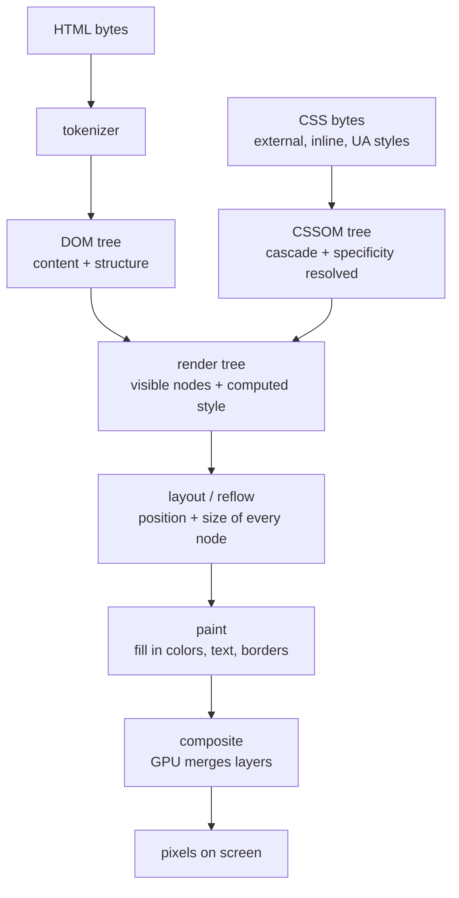

<Lede>
I once had a scroll-linked animation that pegged a mid-range Android phone's CPU at 100% and dragged it down to about 12fps. I spent a whole afternoon changing colors and shadows before I found the actual line: I was reading `element.offsetHeight` inside the same loop where I was writing `element.style.top`, forcing the browser to recompute layout synchronously on every single iteration. Forty times a frame, sometimes more. Fixing it took one line. Understanding *why* it was so expensive took actually learning what the browser does between "here's some HTML" and "here are pixels."
</Lede>

Here's the whole pipeline, the same one that was quietly getting hammered forty times a frame in my bug:

<Figure caption="The browser's rendering pipeline: HTML and CSS become two separate trees, those merge into a render tree, layout figures out geometry, paint fills in pixels, and compositing lets the GPU handle some of that work independently.">



</Figure>

<Toc />

## the DOM: parsing bytes into a tree

The browser doesn't wait for the whole HTML file before it starts working. It reads bytes, turns them into characters, turns those into tokens, and builds the **Document Object Model** as it goes: every tag becomes a node, every node is an object with properties and methods JavaScript can touch.

The DOM is purely structural at this point. `<div class="hero">` is a node with a class attribute, full stop. Nothing about how it looks has been decided yet.

## the CSSOM: the same idea, for styles

While the DOM is being built, the browser is doing the equivalent thing with CSS: pulling in external stylesheets, inline styles, embedded `<style>` blocks, and the browser's own default styles, then parsing all of it into the **CSS Object Model**. This is also a tree, but it represents rules, not content.

This is also where the cascade actually happens. Specificity, inheritance, `!important`, source order, all of it gets resolved here, producing one final computed style per element rather than a pile of competing rules.

## the render tree: where the two meet

DOM and CSSOM are still two separate trees at this point, and neither one alone tells the browser what to draw. Merging them produces the **render tree**: the DOM's visible nodes, each carrying its resolved computed style.

<Important title="the render tree skips invisible nodes">
`<head>`, anything with `display: none`, script tags, none of that takes up visual space, so none of it gets a render tree node. This isn't an afterthought, it's a real optimization: work never gets spent laying out or painting something nobody will see. `visibility: hidden`, by contrast, still reserves its spot and still gets a node, it's just not drawn.
</Important>

## layout, aka reflow: figuring out where everything goes

The render tree says what needs to appear. It says nothing about where. That's layout's job, and it's also called reflow, because it's the same computation whether it's happening for the first time or the fortieth.

The browser walks the render tree and works out exact position and size for every node, applying the box model (content, padding, border, margin) and however the relevant layout mode, block flow, flexbox, grid, table, decides to arrange siblings. Browsers try to do this in one pass over the tree where they can. They don't always get that: a table with intrinsic sizing, or a flex container whose children's sizes depend on each other, can force multiple passes before everything settles.

This is also exactly the operation that reading `offsetHeight`, `offsetWidth`, `scrollTop`, `getComputedStyle()`, or `getBoundingClientRect()` from JavaScript forces to run immediately, on demand, instead of on the browser's own schedule. If layout is already stale because you just wrote a style change, the browser has no choice: it must reflow right there before it can hand you a correct number. Do that write-then-read in a loop and you get **layout thrashing**, which is precisely what my animation bug was.

## paint and compositing: turning boxes into pixels

Once every node has a position and a size, paint fills them in: background, text, borders, shadows, whatever the computed style says should be visible. This doesn't happen onto one flat surface. The browser paints onto separate layers, which is what lets it repaint one part of the page without touching the rest.

Those layers get merged by the compositor, and this is the part that matters most for animation performance: some properties, `transform` and `opacity` chief among them, can be handled almost entirely on the compositor thread, on the GPU, without going back through layout or even paint. That's why animating `transform: translate()` stays smooth even on weak hardware, while animating `top` or `width` does not: one of them skips two expensive stages, the other one triggers both, every frame.

## reflow vs repaint: why one freezes the page and the other doesn't

**Reflow** recalculates geometry: position and size. Because elements affect their neighbors, changing one node's dimensions can cascade into recalculating a large chunk of the page, sometimes all of it. Add a large image above a paragraph and everything below has to shift down; resize that image and the whole downstream layout has to be redone. That cascading is what makes reflow the expensive one.

Common things that trigger it:

- Changing `width`, `height`, `padding`, `margin`, `border`, `font-size`, or `line-height`
- Inserting or removing DOM elements
- Toggling `display` between `none` and anything else
- Resizing the browser window
- Reading a layout-dependent property (`offsetHeight`, `getBoundingClientRect()`, and the like) right after a write, forcing a synchronous reflow
- A `:hover` rule that changes something layout-affecting, like `width`

The fix that would have saved me an afternoon is simple: batch the writes. Instead of touching layout-affecting styles one at a time, change a class once and let the browser compute the result in a single pass.

<Cols cols={2}>
<Col>

Multiple reflows, one per line:

```javascript
element.style.width = "100px";
element.style.height = "50px";
element.style.margin = "10px";
```

</Col>
<Col>

One reflow, via a class swap:

```javascript
element.classList.add("new-dimensions");
// .new-dimensions { width: 100px; height: 50px; margin: 10px; }
```

</Col>
</Cols>

And if you actually need to read layout values, read all of them first, then write. Interleaving reads and writes in a loop is what turns a cheap operation into layout thrashing.

## repaint: cheaper, but not free

**Repaint** is what happens when a visual property changes without touching geometry at all: same position, same size, different pixels. Because it skips layout entirely, it's less costly than reflow, but the browser still has to redraw whatever changed, and large areas or heavy effects (gradients, shadows) still cost real CPU time on weaker devices.

Things that trigger a repaint without a reflow: `background-color`, `background-image`, text `color`, `visibility` (since it still reserves layout space unlike `display: none`), `box-shadow`, `text-shadow`, `outline`, `border-radius` when it doesn't change the border's width, and `opacity`.

The properties worth actually animating are the ones that skip both stages: `transform` and `opacity`. Both can get their own compositor layer, handed to the GPU, moved or faded independently of everything underneath. Everything else you animate is either a reflow or a repaint on the main thread, competing with whatever else the page is doing that frame.

## the mental model, compressed

<Checklist title="before you write another animation or DOM-heavy loop">
- [ ] Know which stage a property change triggers: reflow, repaint, or neither
- [ ] Batch layout-affecting style changes into one class toggle instead of many property writes
- [ ] Never interleave a layout read (`offsetHeight`, `getBoundingClientRect()`) with a layout write inside a loop
- [ ] Prefer animating `transform` and `opacity` over `top`/`left`/`width`/`height`
- [ ] Remember `display: none` removes a node from the render tree; `visibility: hidden` doesn't
- [ ] When something feels janky, check whether it's forcing synchronous layout before touching anything else
</Checklist>

<InkBand title="bottom line">
Everything you see on a page is the output of one pipeline: HTML and CSS get parsed into two trees, those merge into a render tree, layout works out geometry, paint fills in pixels, and compositing lets the GPU take some of that off the main thread. Reflow is expensive because it cascades through the tree; repaint is cheaper because it skips geometry entirely; `transform` and `opacity` are cheapest of all because they can skip both. My afternoon of debugging came down to one loop doing a layout read and a layout write back to back, forcing the expensive path on every iteration. Knowing the pipeline is what made that line visible instead of invisible.
</InkBand>

<Hand>
next time an animation janks on you, check what you're reading and writing in the same loop before you touch anything else.
</Hand>
