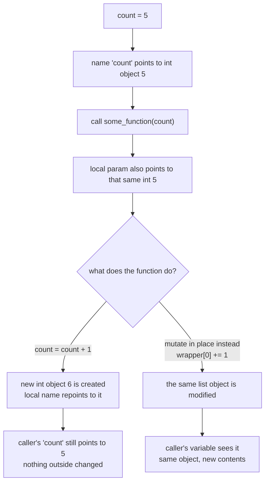

<Lede>
I was writing a retry counter for one of my scraper scripts, the kind that backs off and tries again when a site 403s you. Simple enough, I thought: pass the counter into a helper, bump it, move on. Except the counter never budged. I'd call `bump(count)` a dozen times in a loop and outside the function `count` just sat there at zero, like nothing had happened. I came from C++, where you slap an `&` on the parameter and you're done. Python has no such thing, and once I understood why, a lot of the language clicked into place at once.
</Lede>

Short version before the long one: Python doesn't pass by reference, and it doesn't pass by value either. It does something else entirely, and which fix you reach for depends on whether the thing you passed in can change itself in place.

<Toc />

<Figure caption="What actually happens when an object crosses a function boundary: reassignment breaks the link back to the caller, in-place mutation doesn't.">



</Figure>

## variables are name tags, not boxes

The mental model I had to throw out first: a variable as a labeled box holding a value. That's how C works, more or less, and it's wrong for Python.

When you write:

```python
count = 5
```

you're not filling a box called `count` with the number 5. You're creating an integer object `5` somewhere in memory, then sticking a name tag on it that says `count`. That's it. The name is separate from the object, and nothing stops you from putting a second name tag on the same object.

This is the whole ballgame for understanding function arguments in Python.

## pass by assignment: the actual mechanism

People call this "pass by assignment" or "call by object reference." Neither name is catchy, but here's what happens on a call:

<Steps>
<Step>The parameter becomes a new name in the function's local scope.</Step>
<Step>That new name gets attached to the same object the caller's variable points to.</Step>
<Step>Both names now refer to one object. Nothing was copied.</Step>
</Steps>

So it's not "pass by reference" in the C++ sense, where the parameter is an alias for the caller's storage slot. It's more like handing the object a second name tag. What you do with that name tag next is where the whole thing gets interesting.

## why integers refuse to cooperate

Here's the retry-counter bug, distilled:

```python
def try_to_increment(count):
    print(f"Inside (before):  id={id(count)}, value={count}")
    count = count + 1  # the key line
    print(f"Inside (after):   id={id(count)}, value={count}")

my_count = 5
print(f"Outside (initial): id={id(my_count)}, value={my_count}")

try_to_increment(my_count)

print(f"Outside (after):   id={id(my_count)}, value={my_count}")
```

```
Outside (initial): id=140707765997200, value=5
Inside (before):   id=140707765997200, value=5
Inside (after):    id=140707765997232, value=6
Outside (after):   id=140707765997200, value=5
```

Look at the `id` values, those are memory addresses. Both `my_count` and `count` start out pointing at the exact same `5` object, same id. Then `count = count + 1` runs, Python computes `6`, creates a brand new integer object for it, and repoints the local name `count` at that new object. The id changes because it's a genuinely different object now. Meanwhile `my_count` back in the caller never moved. It's still pointing at the original `5`, because nobody ever touched that object, we just stopped looking at it from inside the function.

<Note title="Why a new object at all?">
Because integers are immutable. You can't edit a 5 into a 6, you can only make a new 6 and start pointing there instead.
</Note>

## fix 1: return the new value

The boring, correct fix, and the one I should have reached for immediately:

```python
def increment_count(current_count: int) -> int:
    """Increments a count and returns the new value."""
    return current_count + 1

my_count = 5
my_count = increment_count(my_count)
print(my_count)  # 6
```

This makes the data flow explicit, you can see exactly where the new value comes from and where it goes. For anything immutable, int, str, tuple, this is the move. Not a workaround, just how you're supposed to do it.

## fix 2: hand it something mutable

If the object you pass in can change itself in place, the picture flips completely. Both names still point at the same object, so a change made through one name is visible through the other. No reassignment needed, no new object created.

<Tabs>
<Tab title="List">

```python
def increment_count_list(count_wrapper: list):
    count_wrapper[0] += 1

my_count_list = [10]
increment_count_list(my_count_list)
print(my_count_list[0])  # 11
```

The list itself never gets replaced, only its contents change. `count_wrapper` and `my_count_list` are two names on one object the whole time.

</Tab>
<Tab title="Dictionary">

```python
def increment_count_dict(counter: dict):
    counter['value'] += 1

my_counter = {'value': 10}
increment_count_dict(my_counter)
print(my_counter['value'])  # 11
```

Same story, a dict is mutable, so writing to a key mutates the shared object instead of creating a new one.

</Tab>
<Tab title="Custom class">

For anything with more shape than a bare counter, a class is usually the cleaner answer:

```python
class Counter:
    def __init__(self, initial_value: int = 0):
        self.value = initial_value

    def __str__(self):
        return f"Counter(value={self.value})"

def increment_counter(counter: Counter):
    counter.value += 1

my_counter = Counter(10)
increment_counter(my_counter)
print(my_counter)  # Counter(value=11)
```

Instances are mutable by default, so this works the same way as the list and dict, just with a name that says what it's for.

</Tab>
</Tabs>

That's the retry counter fixed, by the way, I just wrapped it in a tiny `RetryState` class instead of passing a bare int around and calling it a day.

## fix 3: global, which I'd rather you didn't

`global` exists and it does modify the outer variable:

```python
count = 5

def increment_count_global():
    global count
    count += 1

increment_count_global()
print(count)  # 6
```

<Danger title="use sparingly">
It works, but it wires a function to a specific name living somewhere else in the module, and every other function that touches `global count` becomes a hidden dependency on every other one. Debugging that later means grepping the whole file to find who last touched it. I use this maybe once a year, for actual module-level singletons, never for something like a retry counter that should just live in local scope.
</Danger>

## when to reach for which

Compressed down to a ladder, in the order I actually check them:

- **Return the new value** when the value is immutable (int, str, tuple) or the function's whole job is "compute this and hand it back." This is the default. Reach for it first.
- **Pass a mutable container or a class instance** when you need to update state that several callers share, or the object is big enough that copying it back and forth would be wasteful.
- **Use a class specifically** once the state has more than one field or any behavior attached to it. A bare list-as-a-box gets unreadable fast.
- **Use `global`** only for real module-level singletons you'd have anyway, config that's set once and read everywhere. If you're using it to fix a function signature, you're using it wrong.

## the payoff

None of this is Python being difficult for its own sake. Returning values keeps data flow visible instead of hidden inside a mutation you have to go find. And once mutable versus immutable clicks, the rest of the behavior stops being a special case you memorize and starts being the obvious consequence of "everything is an object, some objects can change themselves and some can't."

**Bottom line:** Python passes object references by assignment, full stop, there's no separate reference-passing mode to look for. Whether a function's changes are visible outside it depends entirely on whether you handed it something mutable. For a bare counter, return the new value. For shared state, wrap it in something mutable, ideally a small class once it's got more than one field. Save `global` for the rare thing that's actually global.

<Hand>
if a value won't update across a function call, check whether you're holding an int before you check anything else.
</Hand>
