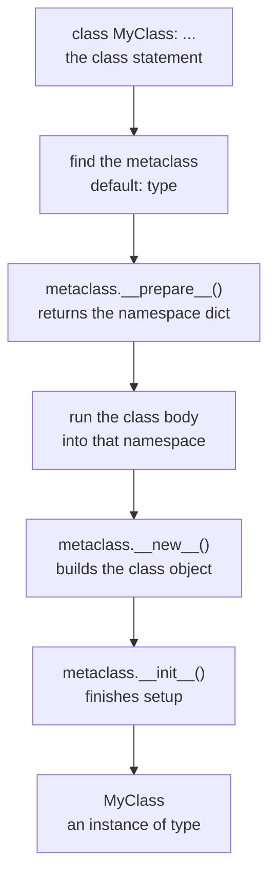

<Lede>
I was building a small plugin loader, drop a class file in a folder and have it register itself without any extra wiring. A decorator would've done the job fine, but I'd read somewhere that metaclasses were the "real" way to do this kind of thing, so I used one. It worked on the first try, which was almost annoying, because I couldn't actually explain why. That sent me down a rabbit hole into how Python builds classes in the first place, and it turns out "everything in Python is an object" isn't just a slogan people repeat at meetups. It applies to classes too, which means something has to build them.
</Lede>

If classes are objects, something creates them, the same way a class creates its instances. That something is called a metaclass, and once you see how it works, a bunch of Python internals stop being magic.

<Toc />

## the trick question: is `type` a function or a class

Start with `type`, which you've probably used a hundred times without thinking about it:

```python
x = 5
print(type(x))  # <class 'int'>
```

Called with one argument, `type` behaves like a function that hands back an object's type:

```python
>>> type(42)
<class 'int'>
>>> type("hello")
<class 'str'>
>>> type([1, 2, 3])
<class 'list'>
```

But `type` has a second job. It's also the default metaclass, the class that creates other classes. Every class you define is, by default, an instance of `type`:

```python
class MyClass:
    pass

# MyClass is an object...
print(type(MyClass))  # <class 'type'>

# ...created by type!
my_instance = MyClass()
print(type(my_instance))  # <class '__main__.MyClass'>
```

`type` is to `MyClass` what `MyClass` is to `my_instance`. A specific car is an instance of the `Car` class, and `Car` itself is an instance of `type`. It's the same relationship, one level up.

## what actually happens when python hits `class`

When Python sees a `class` block, it doesn't just conjure a class object out of nowhere. There's an actual sequence of steps, and it's the same sequence every time, whether you notice it or not.

<Figure caption="Five steps between the class statement you write and the class object you get back.">



</Figure>

Take this class:

```python
class MyClass:
    class_variable = 10

    def __init__(self, value):
        self.value = value

    def display(self):
        print(f"Value: {self.value}")
```

<Steps>
<Step title="Determine the metaclass">

Python figures out which metaclass builds this class. Unless told otherwise, that's `type`.

```python
# Explicitly specifying a metaclass
class MyClass(metaclass=type):  # This is the default
    pass

# Or with a custom metaclass
class MyClass(metaclass=CustomMetaclass):
    pass
```

</Step>
<Step title="Prepare the namespace">

The metaclass's `__prepare__` gets called to create the dict that will hold the class's attributes. `type` just returns an empty dict here; custom metaclasses can hand back something fancier, like an ordered or validating container.

```python
namespace = type.__prepare__('MyClass', (), {})
# Returns: {}
```

</Step>
<Step title="Execute the class body">

Python runs everything inside the `class` block. Each method and class variable lands in that namespace dict as it's defined.

```python
namespace['class_variable'] = 10
namespace['__init__'] = <function __init__ at 0x...>
namespace['display'] = <function display at 0x...>
```

At this point there's still no class, just a dict full of what will become its attributes.

</Step>
<Step title="Create the class object">

Now the metaclass's `__new__` gets called with the name, the base classes, and that namespace dict:

```python
MyClass = type.__new__(
    type,                    # The metaclass
    'MyClass',               # The name
    (),                      # Base classes (empty tuple)
    namespace                # The attributes dictionary
)
```

This is the step that actually allocates the class object.

</Step>
<Step title="Initialize it">

Finally `__init__` runs on the freshly created class for any extra setup:

```python
type.__init__(MyClass, 'MyClass', (), namespace)
```

After this, `MyClass` is a real, usable class.

</Step>
</Steps>

None of this is exotic. It's just the same object-construction pattern Python uses everywhere else, applied one level up.

## creating a class without the `class` keyword

Here's the part that made the whole thing click for me: since `type` is what builds classes, you can call it directly and skip the `class` statement entirely.

```python
# Creating a class the traditional way
class Dog:
    species = "Canis familiaris"

    def __init__(self, name):
        self.name = name

    def bark(self):
        return f"{self.name} says woof!"

# Creating the exact same class with type()
def dog_init(self, name):
    self.name = name

def dog_bark(self):
    return f"{self.name} says woof!"

Dog = type('Dog', (), {
    'species': 'Canis familiaris',
    '__init__': dog_init,
    'bark': dog_bark
})

# Both work identically!
fido = Dog("Fido")
print(fido.bark())  # Fido says woof!
print(fido.species)  # Canis familiaris
```

Both `Dog`s behave identically, because they went through the exact same five steps, one via source code, one via a direct call. This is the whole trick behind ORMs that build model classes from a schema, or any tool that generates classes from configuration at runtime.

## custom metaclasses: taking control

This is what my plugin loader was actually doing. A custom metaclass lets you hook into that `__new__` step and change what comes out the other end, for every class that uses it. Here's a small one that stamps a `describe()` method onto anything built with it:

```python
class DescriptiveMeta(type):
    def __new__(mcs, name, bases, namespace):
        # Add a describe method to every class
        def describe(self):
            return f"I am an instance of {name}"

        namespace['describe'] = describe

        # Call the parent metaclass to actually create the class
        return super().__new__(mcs, name, bases, namespace)

class Person(metaclass=DescriptiveMeta):
    def __init__(self, name):
        self.name = name

class Dog(metaclass=DescriptiveMeta):
    def __init__(self, name):
        self.name = name

# Both classes automatically have the describe method!
person = Person("Alice")
dog = Dog("Rex")

print(person.describe())  # I am an instance of Person
print(dog.describe())      # I am an instance of Dog
```

`Person` and `Dog` never mention `describe` themselves. It just shows up, because the metaclass injected it at step 4, before the class object was even finished being built.

## the singleton: the metaclass trick everyone eventually meets

Sooner or later you'll bump into a metaclass implementing Singleton, and it's worth understanding once you know `__new__` isn't the only hook available. This one overrides `__call__` instead, the method that runs when you write `MyClass()`:

```python
class SingletonMeta(type):
    _instances = {}

    def __call__(cls, *args, **kwargs):
        # __call__ is invoked when you do MyClass()
        if cls not in cls._instances:
            # First time creating this class - create the instance
            instance = super().__call__(*args, **kwargs)
            cls._instances[cls] = instance
        return cls._instances[cls]

class Database(metaclass=SingletonMeta):
    def __init__(self):
        print("Initializing database connection...")
        self.connection = "Connected!"

# Try to create multiple instances
db1 = Database()  # Initializing database connection...
db2 = Database()  # (no output - returns existing instance)

print(db1 is db2)  # True - same object!
```

First call actually builds a `Database`. Every call after that hands back the same object from `_instances`. No global variable, no manual guard clause, the metaclass just intercepts instantiation itself.

## the circular foundation underneath it all

Here's the part that's genuinely a little strange: `type` inherits from `object`, and `object` is an instance of `type`.

```python
>>> isinstance(type, object)
True
>>> isinstance(object, type)
True
>>> issubclass(type, object)
True
```

`type` is a subclass of `object`, but `object` is itself built by `type`. It's a two-node loop sitting at the bottom of the whole object model, and it's not a bug, it's the thing that lets "everything is an object" actually be true without infinite regress.

<Note title="Fun fact">
This circularity isn't something the interpreter special-cases at runtime for your classes, it's baked in once at startup. Every class you write still goes through the same five-step dance from `type` on down.
</Note>

## should you ever write one of these

<Caution title="Honest truth">
Most of the time, no. Tim Peters, one of Python's core developers, put it better than I could:
</Caution>

> "Metaclasses are deeper magic than 99% of users should ever worry about. If you wonder whether you need them, you don't."

I didn't need one for that plugin loader, a decorator that appends to a registry list would've been five lines and obvious to anyone reading it later. Metaclasses earn their keep in framework code: Django's ORM uses one to turn model class bodies into database table definitions, and anything building a small DSL inside Python leans on the same trick. For everyday application code, a decorator, a classmethod, or plain inheritance covers nearly everything a metaclass would, with a fraction of the surprise.

## the short version

<Panel title="what actually matters here" tone="accent">

- Classes are objects too, and `type` is the metaclass that builds them by default.
- Creating a class is a five-step sequence: pick the metaclass, prepare the namespace, run the body into it, call `__new__`, call `__init__`.
- `type(name, bases, dict)` does all five steps directly, no `class` statement required, which is how dynamic class generation works.
- Custom metaclasses hook `__new__` (shape the class as it's built) or `__call__` (control what happens when it's instantiated).
- Reach for one only when you're building a framework or a DSL. Everywhere else, a decorator or a classmethod does the same job with less magic.

</Panel>

**Bottom line:** every class you've ever written passed through `type.__new__` and `type.__init__` whether you saw it happen or not, and that's the whole trick behind dynamic class creation, ORMs, and Singleton metaclasses alike. Knowing the mechanism doesn't mean you should reach for it. My plugin loader works fine now, but if I rebuilt it today, I'd rip out the metaclass and use a decorator instead. The magic was never necessary, I just didn't know that yet.

<Hand>
if you ever catch yourself reaching for a metaclass, ask once more whether a decorator would've done it.
</Hand>
