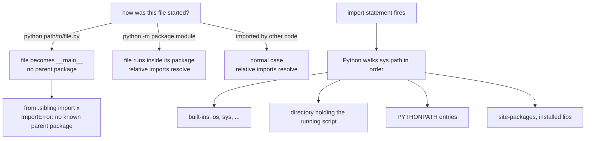

<Lede>
I was working on one of my scraper projects and wanted to sanity-check a single fetcher module without booting the whole FastAPI app. Obvious move, right, just run the file directly: `python fetchers/tanishq_fetcher.py`. Python's response was `ImportError: attempted relative import with no known parent package`, which, at the time, meant nothing to me. The module imported fine everywhere else. Just not like this. Turns out the error was correct and I was the one who didn't understand what "running a file" actually does to Python's notion of packages.
</Lede>

The import system has a reputation for being confusing, and it kind of is, until you see the one distinction that explains almost every error people hit: a file you run directly is not the same thing as a file that gets imported, even if it's the exact same file.

<Toc />

<Figure caption="Where an import actually looks, and why the same file behaves differently depending on how you launched it.">



</Figure>

## the error, explained properly

Here's the thing that finally made it click. When you run `python fetchers/tanishq_fetcher.py`, that file doesn't become "a module inside the `fetchers` package that I happen to be executing." It becomes `__main__`. That's its whole identity as far as the import system is concerned, a top-level script with no parent, no package, nothing above it. A relative import like `from .helpers import clean_price` says "go one level up from my package and grab this," but `__main__` has no package to go up from. The error isn't Python being fussy, it's Python telling you the truth: there is no parent here to reference.

Importing the same file from somewhere else is a completely different story, because then it's not `__main__`, it's `fetchers.tanishq_fetcher`, sitting exactly where it expects to be, parent package and all.

<Danger title="you cannot run a module with relative imports directly as a script">

```bash
python fetchers/tanishq_fetcher.py
# ImportError: attempted relative import with no known parent package
```

Two fixes. Run the actual entry point instead, the one that imports this module rather than executing it directly. Or use `python -m fetchers.tanishq_fetcher` from the project root, which tells Python to load the file as part of its package instead of as a bare script.

</Danger>

## project layout, since it's what the whole error depends on

None of this makes sense without a shape to point at, so here's the layout I'll use for the rest of this:

```
my_project/
├── __init__.py          # makes my_project a package
├── main.py               # entry point
├── requirements.txt
├── package_a/
│   ├── __init__.py
│   ├── module_a1.py
│   └── module_a2.py
└── package_b/
    ├── __init__.py
    ├── module_b1.py
    └── subpackage_c/
        ├── __init__.py
        └── module_c1.py
```

That `__init__.py` sitting in every directory is what tells Python "this is a package, not just a folder that happens to hold `.py` files." It can be empty, and often is, but it's also a legitimate place to re-export things:

```python
# my_project/package_a/__init__.py
from .module_a1 import greet_a1
from .module_a2 import extended_greet

VERSION = "1.0.0"
__all__ = ['greet_a1', 'extended_greet', 'VERSION']
```

Now `from package_a import greet_a1` works, instead of the longer `package_a.module_a1.greet_a1`. Small thing, but it's the difference between a package with a clean public surface and one where callers have to know your internal file layout.

## how python actually finds anything

When you write `import something`, Python checks a fixed order of places, and `sys.path` is the whole list:

```python
import sys
print(sys.path)
```

Built-in modules first (`os`, `sys`, the interpreter's own stuff), then the directory holding whatever script you ran, then `PYTHONPATH` if you've set it, then the standard library, then `site-packages` for anything installed with pip. That second entry, the running script's directory, is exactly why `__main__` gets special treatment: Python adds that one directory automatically, it doesn't know or care that `fetchers/` is supposed to be a package too.

## absolute imports: the one you want in entry points

Absolute imports spell out the full path from the project root:

```python
# my_project/main.py
from package_a import module_a1
from package_b import module_b1

def run():
    module_a1.greet_a1()
    module_b1.perform_task()

if __name__ == "__main__":
    run()
```

<Tabs>
<Tab title="From above my_project">

```bash
python my_project/main.py
```

</Tab>
<Tab title="From inside my_project">

```bash
python main.py
```

</Tab>
</Tabs>

I default to absolute imports basically everywhere now, because they don't lie to you. `from package_a import module_a1` means exactly what it says, no counting dots, and renaming a parent directory doesn't quietly break every import three files deep. The one place they don't help is inside a package that might get renamed or moved as a unit, which is what relative imports are actually for.

## relative imports: for staying inside your own package

Relative imports use dots the way Unix paths use them: `.` is the current package, `..` is the parent, `...` the grandparent, and so on. They only make sense between siblings inside the same package.

```python
# my_project/package_a/module_a2.py
from .module_a1 import greet_a1, HelperClass
```

```python
# my_project/package_b/module_b1.py
from .subpackage_c.module_c1 import perform_subtask
```

```python
# my_project/package_b/subpackage_c/module_c1.py
from ..module_b1 import perform_task
# calling perform_task() here would create a circular import, don't
```

The payoff is that if you ever rename `package_a` to something else, none of the imports inside it need to change, they're relative to wherever the package ends up. That's a real benefit. It's also exactly why they blow up the moment you try to run one of those files directly, they were never written to stand alone.

## the `-m` flag, for when you do need to run something inside a package

If you actually need to execute a module that lives inside a package, and it uses relative imports, don't run it as a bare script. Run it as a module:

```bash
# from the project root
python -m my_project.package_a.module_a2
```

This is the fix for my original problem, by the way. `python -m fetchers.tanishq_fetcher` from the repo root runs the exact same code, except now Python knows it's `fetchers.tanishq_fetcher`, not some orphaned `__main__`, so every relative import inside it resolves the way it's supposed to.

## modules are objects, which is the part nobody tells you upfront

Here's a detail that reframes the whole system once it lands: a module isn't a special language construct, it's an object, the same way an instance of a class is an object.

```python
import my_module
print(type(my_module))          # <class 'module'>
print(sys.modules['my_module']) # the same object
```

`import` does four things: search `sys.path` for the file, create a module object, execute the file's code inside that object's namespace, then cache the result in `sys.modules`. That cache is why importing the same module twice doesn't re-run its top-level code twice, and why `math is math2` is `True` even after two separate `import math` / `import math as math2` lines, you got the same cached object both times. Compare that to a class, where every `MyClass()` call makes a genuinely new object. A module is closer to a singleton than to a blueprint.

Packages get the same treatment, `import package_a` finds `package_a/__init__.py`, builds a module object, runs the init file inside it, and caches it under `sys.modules['package_a']`. So `from package_a import module_a1; module_a1.greet_a1()` is doing attribute access on a module object, structurally the same thing as calling a method on a class instance.

## a real-ish layout, and where each import type shows up

```
blog_project/
├── main.py
├── config.py
├── models/
│   ├── __init__.py
│   ├── user.py
│   └── post.py
├── database/
│   ├── __init__.py
│   └── connection.py
├── api/
│   ├── __init__.py
│   ├── routes.py
│   └── middleware.py
└── utils/
    ├── __init__.py
    ├── validators.py
    └── helpers.py
```

```python
# main.py, absolute imports, this is the entry point
from config import DATABASE_URL
from database.connection import init_db
from api.routes import setup_routes
from models import User, Post

def main():
    init_db(DATABASE_URL)
    app = setup_routes()
    app.run()

if __name__ == "__main__":
    main()
```

```python
# models/post.py, relative import, staying inside the models package
from .user import User

class Post:
    def __init__(self, author: User, content: str):
        self.author = author
        self.content = content
```

```python
# api/routes.py, both kinds in one file, which is normal
from models import User, Post          # absolute, crossing packages
from utils.validators import validate_email
from .middleware import auth_required  # relative, same package
```

That last file is the pattern I actually reach for: absolute for anything crossing a package boundary, relative for a strict sibling in the same directory. Mixing them isn't a code smell, it's just being specific about distance.

## troubleshooting, the three you'll actually hit

**"No module named X."** Almost always one of: you're running from the wrong directory, an `__init__.py` is missing somewhere in the chain, or you've got a typo in the path. Check those three before you touch `sys.path`.

**"Attempted relative import with no known parent package."** You ran a file with relative imports directly as a script. Run the entry point instead, or use `python -m package.module`.

**Circular imports**, module A imports B, B imports A. The real fix is restructuring so the dependency only flows one direction, but the quick patches are moving one of the imports inside a function so it only resolves at call time, or using a quoted type hint as a forward reference if it's only needed for typing.

## the ladder

- **Absolute imports** for entry points, test files, and anything crossing a package boundary. Default to this.
- **Relative imports** for a module talking to its own siblings inside the same package, where you actually want the package to be renameable as a unit.
- **`__init__.py` in every package directory**, even empty, it's what makes the directory a package at all.
- **`python -m package.module`** any time you need to execute something that lives inside a package and uses relative imports.
- **Never manipulate `sys.path` by hand** unless you've exhausted the other four. It's a code smell every time I've reached for it.

**Bottom line:** the whole import system makes sense once you stop thinking of "running a file" and "importing a file" as the same operation, they're not, one gives the file a parent package and one doesn't. Use absolute imports for anything that crosses a package boundary or is an entry point, relative imports for strict siblings, and `python -m` when you need to execute something inside a package directly. The error that started this whole post was never wrong, I just hadn't learned to read it yet.

<Hand>
next time `-m` fixes an import error you don't understand, that's your cue to go find out why, not just move on.
</Hand>
