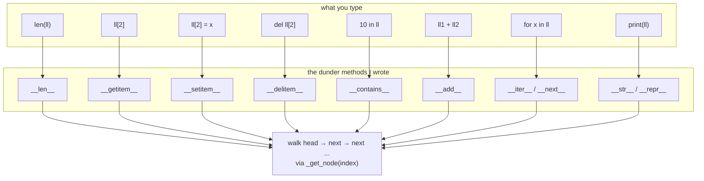

<Lede>
A few weeks back I was drilling linked-list problems for interview prep, and got tired of rewriting the same node-walking boilerplate for every variant. So I built one reusable <code>LinkedList</code> class to bring into any problem. First pass worked fine on its own. Then I tried to drop it into a test harness that did things like <code>assert list(result) == expected</code> and <code>sum(result)</code>, and it just... didn't work. Python had no idea what to do with an object that only had a <code>.append()</code> method. It wasn't a list, it was a bag of nodes with delusions, fair. So I went through the dunder methods one at a time until it actually was one.
</Lede>

This is that walkthrough, in the order I actually ran into each method, gotchas included.

<Toc depth={2} />

## the shape of the problem

Every Python operation you take for granted on a `list` (`len()`, `x[i]`, `for x in ...`, `+`) is really just Python calling a method with two underscores on each side. If your class doesn't define that method, the operation either fails outright or falls back to something you didn't ask for. Here's the map from "thing you type" to "method Python actually calls" to "what happens inside the list":

<Figure caption="Every built-in operation on my LinkedList routes through a dunder method, which then walks the same head-to-tail chain via one internal helper.">



</Figure>

That's the whole post in one picture. Ten dunder methods, one traversal helper underneath all of them. Let's go through them in the order I actually built them.

## the node (barely worth its own heading)

Every linked list needs somewhere to put the data:

```python
class Node:
    """
    Represents a single node in the linked list.
    Contains data and a reference to the next node.
    """
    def __init__(self, data):
        self.data = data
        self.next = None  # points to the next node
```

Nothing to say here. Onward.

## challenge 1: `__init__` and the decision that saves two O(n) walks later

My first draft of `__init__` only tracked `self.head`. That's technically a linked list. It's also a linked list where appending means walking to the end every single time, and where `len()` means counting every node every single time. Both of those are things a real Python list does in O(1), so mine needed to as well:

```python
class LinkedList:
    def __init__(self, initial_data=None):
        """
        Initialize an empty linked list.
        Optionally populate it from an iterable.
        """
        self.head = None    # first node
        self.tail = None    # last node, makes append O(1) instead of O(n)
        self.length = 0     # cached size, makes len() O(1) instead of O(n)

        if initial_data:
            for item in initial_data:
                self.append(item)
```

`head`, `tail`, `length`. Three fields, and each one exists because a naive version of some later method would otherwise cost O(n) for no reason. That's the whole design decision, made once, up front, before I'd written a single dunder method.

## challenge 2: printing the thing without embarrassment

The default `print(my_list)` gives you `<__main__.LinkedList object at 0x7f...>`, which is useless for debugging and useless for users. Python actually wants two different answers here, for two different audiences: `__str__` for a human reading output, `__repr__` for a developer in a debugger who ideally wants something they could paste back into a REPL to recreate the object.

```python
def __str__(self):
    """User-friendly representation for print()."""
    if not self.head:
        return "[]"

    nodes = []
    current = self.head
    while current:
        nodes.append(str(current.data))
        current = current.next
    return f"[{' -> '.join(nodes)}]"

def __repr__(self):
    """Developer-friendly representation for debugging."""
    if not self.head:
        return "LinkedList([])"

    items = []
    current = self.head
    while current:
        items.append(repr(current.data))
        current = current.next
    return f"LinkedList([{', '.join(items)}])"
```

```python
my_list = LinkedList(['a', 'b', 'c'])
print(my_list)        # [a -> b -> c]
print(repr(my_list))  # LinkedList(['a', 'b', 'c'])
```

Same traversal logic, twice, because the two audiences want different strings. I used to skip `__repr__` and just alias it to `__str__`. Don't do that. The moment you're staring at a list of custom objects inside a debugger or a pytest failure, `repr()` is what gets printed for every element, and `<Foo object at 0x...>` times fifty is not a fun read.

## challenge 3: `__len__`, the one you get for free

Because I already cache `self.length` in `__init__`, this one is almost insultingly easy:

```python
def __len__(self):
    """Enable len(my_list). O(1) because we cache the length."""
    return self.length
```

This is the whole payoff of the design decision back in challenge 1. If I hadn't cached `length`, this method would walk the entire chain counting nodes, which defeats the point of `len()` existing as a fast, universal query.

## challenge 4: indexing like a real list

This is where things get real. `my_list[2]` and `my_list[2] = "x"` both need to find the node at index 2, which means walking from `head` some number of times. I wrote that walk once, as a private helper, and both dunders lean on it:

```python
def _get_node(self, index):
    """
    Internal helper to get the node at a specific index.
    Handles negative indices like Python lists.
    """
    if not (-self.length <= index < self.length):
        raise IndexError("Linked list index out of range")

    if index < 0:
        index += self.length  # convert negative to positive

    current = self.head
    for _ in range(index):
        current = current.next
    return current
```

```python
def __getitem__(self, index):
    """Enable my_list[index] to retrieve items."""
    node = self._get_node(index)
    return node.data

def __setitem__(self, index, value):
    """Enable my_list[index] = value to set items."""
    node = self._get_node(index)
    node.data = value
```

```python
my_list = LinkedList([10, 20, 30])
print(my_list[1])     # 20
print(my_list[-1])    # 30
my_list[0] = 15
print(my_list)        # [15 -> 20 -> 30]
```

The bounds check and the negative-index conversion in `_get_node` matter more than they look. Skip the bounds check and `my_list[-100]` walks backward off the front of the list into a `None.next` `AttributeError` instead of a clean `IndexError`. That's the kind of bug that looks fine in every test you write until someone else's code does exactly that.

## challenge 5: `__delitem__`, or how little new code you actually need

By the time I got here I already had a working `pop(index)` method (more on that below), so `del my_list[i]` was a one-liner:

```python
def __delitem__(self, index):
    """Enable del my_list[index]. Leans on our existing pop()."""
    self.pop(index)
```

```python
my_list = LinkedList(['a', 'b', 'c', 'd'])
del my_list[1]  # removes 'b'
print(my_list)  # [a -> c -> d]
```

Worth noticing: this dunder didn't need any new traversal logic. It just gave a name Python already understands to a method I'd have written anyway.

## challenge 6: `__contains__` and the `in` keyword

Without `__contains__`, `x in my_list` would still technically work, because Python falls back to `__iter__` and checks every yielded value. But writing it explicitly documents the intent and, if your data structure ever supports a faster lookup (a hash index, a sorted invariant), gives you a place to put that optimization later:

```python
def __contains__(self, item):
    """Enable 'item in my_list' checks."""
    current = self.head
    while current:
        if current.data == item:
            return True
        current = current.next
    return False
```

```python
my_list = LinkedList([1, 2, 3])
print(2 in my_list)     # True
print(99 in my_list)    # False
```

For a singly linked list there's no faster way to do this than O(n), so honestly this method buys you ergonomics, not speed. Still worth it.

## challenge 7: `__add__` without mutating either side

I wanted `list1 + list2` to behave the way it does for real lists: produce a brand-new list, leave both originals untouched. That last part is the part people get wrong under time pressure, myself included on my first attempt, where I accidentally had `new_list` alias `self` instead of copying it.

```python
def __add__(self, other):
    """
    Enable my_list + other for concatenation.
    Returns a NEW list, leaving originals unchanged.
    """
    new_list = LinkedList()

    current = self.head
    while current:
        new_list.append(current.data)
        current = current.next

    if isinstance(other, LinkedList):
        current = other.head
        while current:
            new_list.append(current.data)
            current = current.next
    elif hasattr(other, "__iter__"):
        for item in other:
            new_list.append(item)
    else:
        raise TypeError(f"Cannot concatenate LinkedList with {type(other)}")

    return new_list
```

```python
list1 = LinkedList([1, 2])
list2 = LinkedList([3, 4])
list3 = list1 + list2
print(list3)  # [1 -> 2 -> 3 -> 4]
print(list1)  # [1 -> 2] (unchanged)
```

The `hasattr(other, "__iter__")` branch is the bit I'd skip if I were being lazy, but it's what lets `my_list + [5, 6]` work against a plain Python list too, not just another `LinkedList`. Small thing, makes the class feel less brittle.

## challenge 8: `__iter__` and `__next__`, the one that took two classes

This is the method that actually makes `for item in my_list:` work, and it's the one dunder here where I had to stop and read the iterator protocol properly instead of guessing.

The rule: `__iter__` must return an iterator, an object with its own `__next__`. It's tempting to just return `self` and add a `__next__` directly on `LinkedList`, and I did that on my first pass. It breaks the moment you try to iterate the same list twice at once, say in a nested loop, because there's only one iteration position shared across both loops. So I split it into a dedicated iterator class instead:

```python
class LinkedListIterator:
    """
    Iterator for LinkedList. Maintains iteration state
    separately from the list itself.
    """
    def __init__(self, head_node):
        self._current = head_node

    def __iter__(self):
        """An iterator must return itself."""
        return self

    def __next__(self):
        """Return next item or raise StopIteration."""
        if self._current is None:
            raise StopIteration

        data = self._current.data
        self._current = self._current.next
        return data
```

```python
def __iter__(self):
    """Return a fresh iterator object on every call."""
    return LinkedListIterator(self.head)
```

```python
my_list = LinkedList(['x', 'y', 'z'])

for item in my_list:
    print(item)  # x, y, z

squares = [x**2 for x in LinkedList([1, 2, 3])]
py_list = list(my_list)
total = sum(LinkedList([10, 20, 30]))  # 60
```

That last line is the actual point of this whole exercise. `sum()` has never heard of `LinkedList`. It just calls `iter()` on whatever you hand it and keeps calling `next()` until `StopIteration`. Once `__iter__` and `__next__` exist, every built-in that accepts an iterable accepts your object for free: `sum`, `max`, `sorted`, `list`, comprehensions, unpacking, all of it.

## challenge 9: `__del__`, the dunder method you should barely touch

I added `__del__` mostly out of curiosity, to see when it actually fires. Welp, turns out the honest answer is "whenever the garbage collector feels like it":

```python
def __del__(self):
    """
    Called when the object is about to be garbage collected.
    Timing is non-deterministic, do not rely on it for cleanup.
    """
    print(f"LinkedList object {id(self)} destroyed")
```

<Caution>
`__del__` runs whenever the garbage collector gets around to it, which is not a moment you control, and in some situations (reference cycles, interpreter shutdown) might not run at all in any useful order. For predictable cleanup, use a context manager instead:
</Caution>

```python
class ResourceHolder:
    def __enter__(self):
        # acquire resource
        return self

    def __exit__(self, exc_type, exc_val, exc_tb):
        # release resource, deterministically
        pass

with ResourceHolder() as holder:
    pass  # cleanup happens here, guaranteed
```

I left `__del__` in the final version purely as a debugging print. If your object is holding a file handle, a socket, or a lock, `__del__` is the wrong tool, full stop. `__enter__`/`__exit__` exist precisely because "eventually, probably" isn't a cleanup guarantee anyone should accept.

## the methods the dunders were quietly leaning on

Every dunder above calls into a handful of ordinary methods that aren't dunders themselves, they're just the linked-list mechanics everyone expects: `append`, `prepend`, `insert`, `remove`, `pop`. `__init__` calls `append`. `__delitem__` calls `pop`. `__add__` calls `append` on the new list, twice. None of the dunder magic works without these underneath it.

```python
def append(self, data):  # O(1)
    """Add element to the end."""
    new_node = Node(data)

    if not self.head:
        self.head = new_node
        self.tail = new_node
    else:
        self.tail.next = new_node
        self.tail = new_node

    self.length += 1

def prepend(self, data):  # O(1)
    """Add element to the beginning."""
    new_node = Node(data)

    if not self.head:
        self.head = new_node
        self.tail = new_node
    else:
        new_node.next = self.head
        self.head = new_node

    self.length += 1

def insert(self, index, data):  # O(n)
    """Insert element at a specific index."""
    if index < 0:
        if abs(index) > self.length:
            raise IndexError("Index out of range")
        index += self.length

    if index == 0:
        self.prepend(data)
    elif index >= self.length:
        self.append(data)
    else:
        new_node = Node(data)
        prev = self._get_node(index - 1)
        new_node.next = prev.next
        prev.next = new_node
        self.length += 1

def remove(self, data):  # O(n)
    """Remove first occurrence of data."""
    if not self.head:
        raise ValueError(f"{data} not in list")

    if self.head.data == data:
        if self.head == self.tail:
            self.head = None
            self.tail = None
        else:
            self.head = self.head.next
        self.length -= 1
        return

    current = self.head
    while current.next and current.next.data != data:
        current = current.next

    if current.next:
        if current.next == self.tail:
            self.tail = current
        current.next = current.next.next
        self.length -= 1
    else:
        raise ValueError(f"{data} not in list")

def pop(self, index=-1):  # O(n)
    """Remove and return the element at index."""
    if self.length == 0:
        raise IndexError("pop from empty list")

    if index < 0:
        index += self.length

    if not (0 <= index < self.length):
        raise IndexError("Index out of range")

    if index == 0:
        data = self.head.data
        if self.head == self.tail:
            self.head = None
            self.tail = None
        else:
            self.head = self.head.next
    else:
        prev = self._get_node(index - 1)
        data = prev.next.data
        if prev.next == self.tail:
            self.tail = prev
        prev.next = prev.next.next

    self.length -= 1
    return data
```

Nothing exotic here. It's the same head-pointer, tail-pointer bookkeeping repeated with slightly different edge cases each time (empty list, removing the head, removing the tail). The tail-pointer maintenance is the part I got wrong twice while writing this: forget to reset `self.tail` when you pop or remove the last node, and the next `append()` silently writes to a node that's no longer reachable from `head`. That bug doesn't crash. It just makes your list quietly shorter than `self.length` claims, which is a nasty one to track down, yk.

## does it actually behave like a Python list?

This was the actual test, the thing I opened this post complaining about:

```python
my_list = LinkedList([1, 2, 3, 4, 5])

print(len(my_list))  # 5

print(my_list[2])    # 3
my_list[2] = 10
print(my_list)       # [1 -> 2 -> 10 -> 4 -> 5]

print(10 in my_list) # True

del my_list[2]
print(my_list)       # [1 -> 2 -> 4 -> 5]

for item in my_list:
    print(item)      # 1, 2, 4, 5

other = LinkedList([6, 7])
combined = my_list + other
print(combined)      # [1 -> 2 -> 4 -> 5 -> 6 -> 7]

total = sum(my_list)        # 12
maximum = max(my_list)      # 5
py_list = list(my_list)     # [1, 2, 4, 5]

my_list.append(99)
my_list.prepend(0)
my_list.insert(2, 1.5)
my_list.remove(4)
popped = my_list.pop()
```

Every one of those lines is a built-in Python operation or function that has never seen `LinkedList` before, working anyway.

## what it costs

None of this is free. Here's the honest complexity, method by method:

| Operation | Time complexity |
| --------- | ---------------- |
| `append()` | O(1) |
| `prepend()` | O(1) |
| `insert(index, item)` | O(n) |
| `__getitem__[index]` | O(n) |
| `__setitem__[index]` | O(n) |
| `__delitem__[index]` | O(n) |
| `remove(item)` | O(n) |
| `pop(index)` | O(n) |
| `__contains__` (`in`) | O(n) |
| `__len__` | O(1) |

That O(n) row for `__getitem__` is the one that trips people coming from arrays: a Python `list` gives you O(1) random access because it's backed by contiguous memory. A linked list never will, no matter how clever the dunder methods look on the surface. If your workload is index-heavy, a linked list is the wrong structure, dunder methods or not. What they buy you is that the *syntax* looks the same, not that the *performance* does. Don't let a nice `__getitem__` implementation talk you out of that.

## the checklist

<Checklist title="When to actually implement each of these">
- [ ] `__len__`: implement it the moment you cache a size anywhere. Don't make callers use a `.get_length()` method for something `len()` should answer directly
- [ ] `__getitem__`: implement it if the object is genuinely a sequence. Only add `__setitem__` if index-assignment is a real use case for your type, not just for symmetry with `__getitem__`
- [ ] `__delitem__`: pair it with `__getitem__`/`__setitem__` if `del obj[i]` is a natural operation; it can almost always just call an existing `pop()` or `remove()`
- [ ] `__contains__`: write it explicitly if you can check membership faster than the default `__iter__` fallback would. If not (like here), it's still worth it for the `in` ergonomics alone
- [ ] `__add__`: only overload it when addition is genuinely unambiguous for your type. If you'd need a comment to explain what `+` means for your object, don't overload it
- [ ] `__iter__`: implement it whenever people will loop over your object. Return a real iterator with its own `__next__`, not `self`, unless the object truly supports only one iteration pass ever
- [ ] `__del__`: skip it almost always. A debug print is fine. Resource cleanup is not; use `__enter__`/`__exit__` for that
</Checklist>

## testing it for real

<Details summary="The full test suite">

```python
def test_linked_list():
    ll = LinkedList()
    assert len(ll) == 0
    assert str(ll) == "[]"

    ll.append(1)
    ll.append(2)
    ll.prepend(0)
    assert list(ll) == [0, 1, 2]

    assert ll[0] == 0
    assert ll[-1] == 2
    ll[1] = 10
    assert ll[1] == 10

    assert 10 in ll
    assert 99 not in ll

    del ll[0]
    assert list(ll) == [10, 2]

    ll2 = LinkedList([3, 4])
    ll3 = ll + ll2
    assert list(ll3) == [10, 2, 3, 4]

    ll.insert(1, 1)
    assert list(ll) == [10, 1, 2]

    ll.remove(1)
    assert list(ll) == [10, 2]

    popped = ll.pop()
    assert popped == 2
    assert list(ll) == [10]

    print("All tests passed")

test_linked_list()
```

</Details>

**bottom line:** dunder methods aren't a checklist you complete, they're a translation layer between "what Python already knows how to do" and "what your object actually does underneath." Implement the ones your object's usage pattern actually needs, in the order you actually hit them, and skip the ones that only exist for the sake of looking complete. Ten methods and one traversal helper turned a bag of nodes into something `sum()`, `max()`, `for`, `in`, `+` and `len()` all accept without a single special case written on their end. That's the whole trick, and it generalizes to trees, queues, whatever custom container you build next.

<Hand>
if you take one thing from this: implement `__iter__` properly, with a real iterator object, the first time. saves you a weird bug in a nested loop three weeks later.
</Hand>
