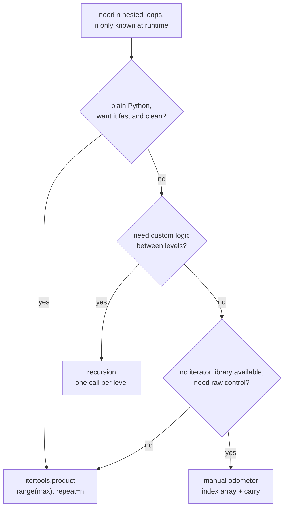

<Lede>
A while back I was messing around with a toy combination-lock simulator, the kind with a configurable number of wheels, each wheel spinning through some range of values. The lock's `n` was a setting a user could type in, not something I could hardcode. So I sat down to write the brute-force "try every combination" function and immediately ran into the obvious wall: `for i in range(x): for j in range(x): for k in range(x):` only works if you already know it's three wheels. What do you write when `n` is 3 today and 7 tomorrow?
</Lede>

You can't nest a fixed number of `for` loops for a number that isn't fixed. That sentence sounds almost too obvious to write down, but it trips up a lot of people the first time they hit it, because the instinct is to reach for more loops, and there's no amount of "more loops" that solves "unknown number of loops." This is a genuinely classic problem, and Python gives you three real ways to solve it, each with a different personality.

<Toc />

## the shape of the problem

Say you want every combination of `n` digits, each digit from `0` to some max value. For `n=2, max=2` that's `[0,0], [0,1], [1,0], [1,1]`. For `n=3, max=2` it's eight combinations. The count is `max^n`, and it gets big fast, my lock simulator with 6 wheels and 10 positions each was already 1,000,000 combinations before I'd typed a single line of brute-force code.

<Figure caption="Three ways to fake nested loops of unknown depth, and which one to reach for first.">



</Figure>

Three tools, three shapes of the same idea. Let's go through them in the order you'd actually hit them.

## recursion: the one that mirrors the problem in your head

Recursion is the most natural way to think about this, because each recursive call *is* one level of nesting. You go one level deeper, make a choice, come back up, try the next choice.

```python
def generate_nested_loops_recursive(
    n: int,
    max_val: int,
    current_level: int = 0,
    current_combination: list = None
):
    """
    Generates all combinations simulating n nested loops using recursion.

    Args:
        n: Number of nested loops (depth)
        max_val: Upper limit for each loop (exclusive)
        current_level: Current recursion depth (internal use)
        current_combination: Current path being built (internal use)
    """
    if current_combination is None:
        current_combination = []

    # Base case: we have a complete combination
    if current_level == n:
        print(f"Combination: {current_combination}")
        # In real use, you might yield this or pass to another function
        return

    # Recursive case: iterate for the current level
    for i in range(max_val):
        current_combination.append(i)  # Make a choice

        # Recurse to the next level
        generate_nested_loops_recursive(
            n, max_val, current_level + 1, current_combination
        )

        current_combination.pop()  # Backtrack for next iteration

# Example usage
print("Generating 3 nested loops, each from 0 to 1:")
generate_nested_loops_recursive(3, 2)
```

```
Generating 3 nested loops, each from 0 to 1:
Combination: [0, 0, 0]
Combination: [0, 0, 1]
Combination: [0, 1, 0]
Combination: [0, 1, 1]
Combination: [1, 0, 0]
Combination: [1, 0, 1]
Combination: [1, 1, 0]
Combination: [1, 1, 1]
```

The code reads almost like the problem statement, which is why I usually reach for this when I'm still figuring out the logic. But recursion in Python isn't free: the default recursion limit sits around 1000, so a lock with a thousand wheels would blow the stack long before it blew your patience. For my simulator, with `n` capped at a sane number of wheels, this was never actually a risk, it just felt slightly wasteful for something this mechanical.

## itertools.product: the one I actually reach for

Python's `itertools` module has a function built for exactly this: `product()` computes the Cartesian product of iterables, which is precisely what nested loops compute.

```python
import itertools

def generate_nested_loops_itertools(n: int, max_val: int):
    """
    Generates all combinations using itertools.product.

    Args:
        n: Number of nested loops (depth)
        max_val: Upper limit for each loop (exclusive)
    """
    single_loop_range = range(max_val)

    # product with repeat=n simulates n nested loops
    for combination in itertools.product(single_loop_range, repeat=n):
        print(f"Combination: {list(combination)}")

# Example usage
print("\nGenerating 3 nested loops using itertools.product:")
generate_nested_loops_itertools(3, 2)
```

```
Generating 3 nested loops using itertools.product:
Combination: [0, 0, 0]
Combination: [0, 0, 1]
Combination: [0, 1, 0]
Combination: [0, 1, 1]
Combination: [1, 0, 0]
Combination: [1, 0, 1]
Combination: [1, 1, 0]
Combination: [1, 1, 1]
```

<Tip title="This is the one I'd reach for">
Once the logic was working with the recursive version, I rewrote the actual lock simulator on top of `itertools.product`. It's three lines shorter, it's implemented in C so it doesn't pay Python's function-call overhead per level, and it returns an iterator instead of building a list, so a lock with a lot of wheels doesn't try to hold every combination in memory at once. For plain Python code with no exotic logic between levels, this wins.
</Tip>

## the manual odometer: when you need full control

There's a third way, and it's the one that shows you what's actually happening under the hood: keep a list of indices and increment it like an odometer, carrying to the next position when one wheel rolls over.

```python
def generate_nested_loops_iterative(n: int, max_val: int):
    """
    Generates all combinations using iterative index manipulation.

    Args:
        n: Number of nested loops (depth)
        max_val: Upper limit for each loop (exclusive)
    """
    if n == 0:
        return

    # Initialize all indices to 0
    indices = [0] * n

    while True:
        # Print current combination
        print(f"Combination: {indices.copy()}")

        # Increment the rightmost index (like an odometer)
        position = n - 1

        while position >= 0:
            indices[position] += 1

            if indices[position] < max_val:
                # No overflow, we're done incrementing
                break

            # Overflow: reset this position and carry to the left
            indices[position] = 0
            position -= 1

        # If we've carried past the leftmost position, we're done
        if position < 0:
            break

# Example usage
print("\nGenerating 3 nested loops using iterative approach:")
generate_nested_loops_iterative(3, 2)
```

```
Generating 3 nested loops using iterative approach:
Combination: [0, 0, 0]
Combination: [0, 0, 1]
Combination: [0, 1, 0]
Combination: [0, 1, 1]
Combination: [1, 0, 0]
Combination: [1, 0, 1]
Combination: [1, 1, 0]
Combination: [1, 1, 1]
```

This is genuinely the actual mechanism inside a real combination lock, which is a little poetic given what I was building. No recursion limit, no function-call overhead, complete control over the state. It's also the version I'd least want to debug at 1am: get the carry logic even slightly wrong and you either skip combinations or loop forever. If you're porting this idea to a language without a good iterator library, this is your template. In Python, I'd only pick it up if the other two were somehow off the table.

## brute-forcing PIN codes, the reason I started this

Back to the lock. Say each wheel is a digit, 0 through 9, and you want every possible PIN of a given length. Same `itertools.product`, different alphabet:

```python
import itertools

def generate_passwords(length: int, charset: str):
    """Generate all possible passwords of given length from charset."""
    count = 0
    for password_tuple in itertools.product(charset, repeat=length):
        password = ''.join(password_tuple)
        count += 1
        # In real use, you'd try this password
        if count <= 10:  # Just show first 10
            print(password)

    print(f"\nTotal passwords: {count}")

# Generate all 3-character passwords using digits
print("3-digit numeric passwords:")
generate_passwords(3, '0123456789')
```

```
3-digit numeric passwords:
000
001
002
003
004
005
006
007
008
009

Total passwords: 1000
```

A 3-digit lock is 1,000 combinations, trivial. My actual 6-wheel simulator was a million. A real 6-digit phone PIN is also a million, which is a good reminder of why "just try every PIN" stops being a joke around 6-8 digits and starts being an actual attack a device needs to rate-limit against.

## benchmarking on my machine

I was curious how much the C implementation actually buys you, so I ran a quick comparison:

```python
import time
import itertools

def benchmark(n, max_val):
    # Recursion
    start = time.time()
    count = 0
    def recurse(level, combo):
        nonlocal count
        if level == n:
            count += 1
            return
        for i in range(max_val):
            recurse(level + 1, combo + [i])
    recurse(0, [])
    recursive_time = time.time() - start

    # itertools
    start = time.time()
    count = sum(1 for _ in itertools.product(range(max_val), repeat=n))
    itertools_time = time.time() - start

    print(f"\nn={n}, max_val={max_val} ({max_val**n} combinations)")
    print(f"Recursion: {recursive_time:.4f}s")
    print(f"itertools: {itertools_time:.4f}s")
    print(f"Speedup:   {recursive_time/itertools_time:.2f}x")

# Run benchmarks
benchmark(3, 10)
benchmark(4, 8)
benchmark(5, 6)
```

<Note>
On my machine, `itertools.product` was consistently faster, usually somewhere in the 2-3x range over plain recursion. Your numbers will move around with Python version and hardware, don't treat any specific multiplier as gospel, but the direction is reliable: the C implementation wins, and the gap narrows a bit as `n` grows because both approaches are ultimately doing `max^n` work either way.
</Note>

## what if each level needs a different range

Real problems rarely want the same range at every level. Say you're generating product variants instead of lock combinations: `itertools.product` handles mismatched iterables just as easily.

```python
import itertools

# Different ranges for each position
colors = ['red', 'blue']
sizes = ['S', 'M', 'L']
materials = ['cotton', 'polyester']

# Generate all product variants
for variant in itertools.product(colors, sizes, materials):
    print(f"{variant[0]} {variant[1]} {variant[2]}")
```

```
red S cotton
red S polyester
red M cotton
red M polyester
...
blue L polyester
```

Same function, no code changes, just different inputs. That's the whole trick with `itertools.product`: it doesn't care whether your "loops" are numeric ranges or lists of strings, which is exactly what makes it useful for product configurators, test-case generation, or anything that smells like "all combinations of these variables."

## whatever you do, don't build the loops as a string

<Danger title="Don't do it">
At some point almost everyone thinks about using `exec()` to write the loop code as a string and run it. Don't. It's a security hole the moment any part of that string comes from outside your program, it's slower because it gets parsed at runtime instead of once, it's miserable to debug because your stack traces point at a string instead of a file, and none of that buys you anything the three approaches above don't already give you.
</Danger>

```python
# DON'T DO THIS!
code = "for i in range(2):\n"
code += "  for j in range(2):\n"
code += "    print([i, j])"
exec(code)  # Evil!
```

## the ladder

<Panel title="pick based on what you're actually building" tone="accent">

- Plain Python, no weird logic between levels: `itertools.product`. It's what I ship.
- Still prototyping, or you need to run different logic at each depth: recursion, it reads like the problem.
- No iterator library, or you're translating this into a language that doesn't have one: the manual odometer.
- Depth in the thousands: rules out recursion outright, so it's `itertools.product` or the odometer.

</Panel>

**Bottom line:** when the number of loops is a runtime value instead of a compile-time constant, `itertools.product(iterable, repeat=n)` is the answer for almost every real Python program, recursion is the answer when you're still thinking through the logic or need custom behavior per level, and the manual odometer is the answer when you need to know exactly what's happening at every step or don't have an iterator library to lean on. Just respect `max^n`. My six-wheel lock was a million combinations before I'd written a single line of the actual cracking logic, and that number only grows from there.

<Hand>
go build your combination lock, or your test matrix, or whatever it is. just don't `exec()` it.
</Hand>
