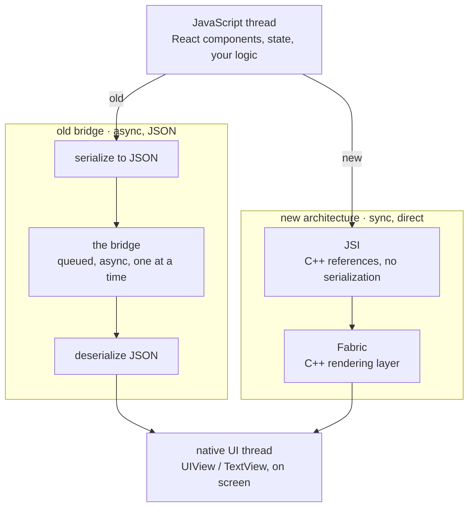

<Lede>
I had a chat screen: message list, a typing indicator that pulsed while someone was composing, nothing exotic. Scroll fast while that indicator was animating, and the whole thing juddered, dropped frames, occasionally froze for a beat. I profiled it expecting to find my own bad code. Instead I found the bridge: every animation tick and every scroll event was getting serialized to JSON, queued, and shipped across an async channel to native code and back. The fix wasn't a better `FlatList` config. It was understanding that React Native's whole old communication model was built for occasional calls, not sixty-times-a-second traffic, and that the New Architecture exists specifically to remove that bottleneck.
</Lede>

<Figure caption="Old path: everything crosses the bridge as serialized JSON, queued and asynchronous. New path: JSI lets JavaScript and native C++ call each other directly, synchronously, no bridge in between.">



</Figure>

<Toc />

## the old bridge, and why it existed

When React Native first shipped, it had to solve a genuinely hard problem: let JavaScript drive real iOS and Android UI without JavaScript ever touching the native side directly. The bridge was the answer, a communication layer sitting between your JS thread and the native UI thread, and for a long time it was good enough.

Three pieces to know:

1. **The JavaScript thread.** Your React components, your state, your Virtual DOM diffing, all here.
2. **The bridge.** When JS needed to update the UI or call something native, it converted the data to JSON, queued it as a message, and waited for native to get around to it, asynchronously.
3. **The native UI thread.** Where the actual `UIView` or `TextView` lives and renders.

A typical call looked like this:

```javascript
// JavaScript side
const updateButtonColor = (color) => {
	// serialized to JSON, then sent across the bridge
	NativeModules.UIManager.updateView(buttonId, {
		backgroundColor: color,
	});
};
```

That's the whole model: JSON out, queue, JSON back. Fine for a button tap. Not fine for a typing indicator animating at 60fps while a list scrolls underneath it.

## where it actually broke down

The bridge wasn't buggy, it was just built for the wrong traffic pattern, and that mismatch shows up in a few specific ways.

**Serialization was the tax on every single call.** Converting data to JSON and back is cheap once. It is not cheap sixty times a second, and that's exactly the rate my typing indicator and scroll events were generating.

**Everything asynchronous meant nothing could just... wait.** JS couldn't block for a native result, so calls that felt like they should be instant went through a queue instead. On a busy bridge, messages backed up, and my animation frames backed up with them.

**One JS thread did three jobs at once.** App logic, state management, and every bit of bridge traffic all fought for the same thread. Let the JS thread get busy for a moment, and UI updates queued behind it, which is the exact "janky" feeling I was chasing.

**Nothing checked that JS and native agreed on types.** If JavaScript sent a shape native didn't expect, you found out at runtime, not before.

**Startup paid for modules you hadn't used yet.** Native modules loaded eagerly at launch whether your first screen touched them or not, which is dead weight on every cold start.

None of these are exotic edge cases. My typing indicator was hitting the first three at once, which is exactly why it was the thing that stuttered instead of, say, a static settings screen.

## the new architecture: cutting the bridge out entirely

The New Architecture, sometimes called Fabric or the JSI-based architecture, isn't a patch on the bridge. It removes it. JavaScript and native code talk directly now, and that one change is what fixes the traffic problem above.

### JSI: the part that actually changes everything

JSI is a thin C++ layer that lets JavaScript hold a real reference to a native C++ object and call its methods, and lets native code call back into JS the same way. No JSON. No queue.

```javascript
// with JSI, this is a direct, synchronous call
const result = nativeModule.someFunction(arg1, arg2);
// no serialization, no bridge, just a C++ function call
```

That's the whole upgrade in one line: instead of writing a letter, sealing it, and waiting for a reply, you're just talking. For something like an animation driver that needs a value every frame, that difference is the entire performance story.

### Fabric: the renderer built for that

Fabric replaces the old UI Manager and Shadow Tree. It's a C++ layer that manages components on both platforms, and it brings a few things the old renderer couldn't:

- layout calculations happen synchronously, so there's no async gap for a frame to slip through
- it's built against React's Fiber reconciler on purpose, not bolted onto it after the fact
- it supports Concurrent Mode, so rendering work can be paused and reprioritized instead of running to completion no matter what
- native views come out of a more unified hierarchy across iOS and Android

### TurboModules: native modules that don't wait

TurboModules are the JSI-era replacement for Native Modules, and the difference you feel immediately is synchronous calls:

<Cols>
<Col>

old way, asynchronous

```javascript
NativeModules.BatteryModule.getBatteryLevel().then((level) =>
	console.log(level)
);
```

</Col>
<Col>

new way, synchronous via TurboModules

```javascript
const level = TurboModuleRegistry.get("BatteryModule").getBatteryLevel();
console.log(level);
```

</Col>
</Cols>

They're also lazy-loaded, so a module you never touch never gets initialized, which is where the startup-time win comes from. And they're generated against a typed spec, so JS and native can't quietly disagree about the shape of a call.

### Codegen: the part that makes the types actually match

Codegen is a build-time tool that reads your module or component definitions and generates the matching interface code on both sides, TypeScript for JS, Objective-C++ for iOS, Java or Kotlin for Android. The point isn't convenience, it's catching a mismatched type at build time instead of watching it blow up at runtime three screens deep in your app.

## the two architectures, side by side

| | old bridge | new architecture |
| --- | --- | --- |
| communication | async JSON messages | sync C++ calls via JSI |
| performance | serialization + bridge queue overhead | direct calls, minimal overhead |
| native modules | eager loading, async only | lazy TurboModules, sync when needed |
| rendering | async UI Manager + Yoga | synchronous Fabric |
| type safety | manual, easy to get wrong | generated by Codegen |
| concurrency | limited | full Concurrent Mode support |
| debugging | stack traces span an async boundary | synchronous calls, easier to trace |

## what this actually bought me

Back to the chat screen. After the app moved onto the New Architecture, the typing indicator stopped competing with scroll events for bridge time, because there was no bridge left to compete over. Concretely:

- animations that used to skip frames under load held steady, because layout and native calls weren't queued behind JSON serialization anymore
- scroll felt noticeably less laggy under the same list size
- cold start was faster, since TurboModules only initialize what a screen actually uses
- fewer "why did this native call return the wrong shape" bugs, because Codegen catches that mismatch before the app ships

None of that required touching my chat component. The architecture change was structural, and my code got faster for free.

## why "fabric" and why "fiber" both show up

Fabric is the rendering engine name. Fiber is React's own reconciliation algorithm, the thing that makes rendering interruptible and prioritizable in the first place. Fabric is built specifically to feed React's Fiber output into native UI commands efficiently, so when you see both names mentioned together, they're not competing projects, Fabric is just the native-side partner that lets Fiber's capabilities actually reach the screen.

## should you migrate?

<Tip title="short answer: yes">
New project, there's no real debate, start on the New Architecture. Existing app, the migration cost is real if you're carrying custom native modules, but the performance and type-safety wins are worth the work, especially if your app has anything like my chat screen: frequent native calls competing with animation or scroll.
</Tip>

The migration tooling has gotten better over time, and most of the pain now lives in third-party libraries that haven't updated their native modules yet, not in your own application code.

## the checklist

- if your JS thread is busy and animations or gestures stutter under it, that's bridge congestion, not necessarily your component logic
- reach for the New Architecture by default on anything new
- audit custom native modules before migrating an existing app, that's where the actual work is
- expect fewer runtime type mismatches once Codegen is generating both sides
- don't expect a rewrite, expect the same JS code to run faster underneath

**Bottom line:** the old bridge did its job for years, but it was built for occasional async calls, not the sixty-times-a-second traffic real interactions produce. JSI removes the serialization step entirely, Fabric renders synchronously on top of it, TurboModules load lazily and call directly, and Codegen keeps both sides honest about types. My chat screen didn't get smoother because I wrote better code, it got smoother because the thing underneath my code stopped standing in its own way.

If you've ever profiled a stutter and found nothing wrong in your own component, check which architecture you're on before you keep digging.
