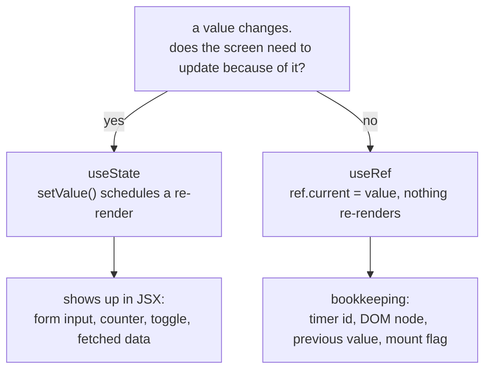

<Lede>
I was bolting a countdown timer onto a side project, nothing fancy, just digits ticking down and a start/stop/reset button. First pass, I stored the `setInterval` handle in `useState` right next to the seconds counter, because they're both "state," right? The timer worked. It also repainted the entire component tree every single second, for no reason anyone asked for, and a completely unrelated input field two levels down would occasionally lose focus mid-type. Turns out I'd been storing two very different kinds of value in the same box.
</Lede>

<Important title="the actual difference">
`useState` tells React "the screen needs to change." `useRef` tells React "keep this around, but mind your own business." Mixing them up doesn't crash anything, it just makes your component do more work than it should, or forget things it needed to remember.
</Important>

<Figure caption="The one question that decides which hook you reach for: does this value need to show up on screen right now?">



</Figure>

<Toc />

## useState: the box that repaints the screen

`useState` is the one you learn first, and for good reason: it's the hook that actually makes the UI move.

```javascript
const [value, setValue] = useState(initialValue);
```

Call `setValue`, and React schedules a re-render. Simple counter, same one everybody's written a hundred times:

```javascript
import React, { useState } from "react";

function Counter() {
	const [count, setCount] = useState(0);

	return (
		<div>
			<p>You clicked {count} times</p>
			<button onClick={() => setCount(count + 1)}>Click me</button>
		</div>
	);
}
```

Click the button, `setCount` fires, React re-runs the component function, the new number shows up. That's the whole contract. It's also the part people forget when they reach for `useRef` "because I don't need a re-render right now" and then wonder why the number on screen never moves.

`useState` is the right call whenever the value is something the user is actually looking at: form fields, a modal's open/closed flag, whatever a fetch just handed you, a list you're rendering. If it's in the JSX, it almost certainly belongs in `useState`.

## useRef: the box React doesn't watch

`useRef` returns an object with exactly one property, `current`, and React genuinely does not care when you change it.

```javascript
const myRef = useRef(initialValue);
```

Read `myRef.current`, write to it, mutate it in a loop if you want, none of that triggers a render. That's not a limitation, it's the entire point.

The most common use is grabbing a DOM node directly:

```javascript
import React, { useRef } from "react";

function TextInputWithFocusButton() {
	const inputRef = useRef(null);

	const handleClick = () => {
		inputRef.current.focus();
	};

	return (
		<>
			<input ref={inputRef} type="text" />
			<button onClick={handleClick}>Focus the input</button>
		</>
	);
}
```

Attach `ref={inputRef}` to an element, and React quietly sets `inputRef.current` to the real DOM node once it's mounted. No re-render involved, because nothing on screen changed, you just got a handle to something that already exists.

Here's the version that actually matches my timer bug, cleaned up:

```javascript
import React, { useState, useRef, useEffect } from "react";

function Stopwatch() {
	const [seconds, setSeconds] = useState(0);
	const intervalRef = useRef(null);

	const start = () => {
		if (intervalRef.current !== null) return; // already running

		intervalRef.current = setInterval(() => {
			setSeconds((s) => s + 1);
		}, 1000);
	};

	const stop = () => {
		clearInterval(intervalRef.current);
		intervalRef.current = null;
	};

	const reset = () => {
		stop();
		setSeconds(0);
	};

	useEffect(() => {
		return () => {
			if (intervalRef.current) clearInterval(intervalRef.current);
		};
	}, []);

	return (
		<div>
			<p>Time: {seconds}s</p>
			<button onClick={start}>Start</button>
			<button onClick={stop}>Stop</button>
			<button onClick={reset}>Reset</button>
		</div>
	);
}
```

`intervalRef` holds the interval ID. Nobody ever needs to see an interval ID on screen, so there's no reason writing to it should repaint anything. `seconds` is the opposite: it's the one number the whole component exists to show, so it lives in `useState` and every tick legitimately re-renders. That split is the fix for my original bug. I had both values in `useState`, and every tick was re-rendering the interval ID along with the seconds, doubling the work for a value nothing ever reads from the render output.

## the two side by side

| | useState | useRef |
| --- | --- | --- |
| purpose | reactive state the UI depends on | mutable storage the UI doesn't depend on |
| returns | `[value, setter]` | `{ current: value }` |
| triggers re-render | yes | no |
| how you change it | call the setter | write `.current` directly |
| persists across renders | yes | yes |
| typical use | form data, API results, toggles | DOM refs, timer ids, previous values |

## react native: same rules, different targets

Good news, none of this changes when you cross into React Native. `useState` still drives what's on screen, `useRef` still grabs handles to native components instead of DOM nodes.

<Tabs>
<Tab title="useState">

```javascript
import React, { useState } from "react";
import { View, Text, TextInput, Button } from "react-native";

function LoginForm() {
	const [email, setEmail] = useState("");
	const [password, setPassword] = useState("");

	return (
		<View>
			<TextInput value={email} onChangeText={setEmail} placeholder="Email" />
			<TextInput
				value={password}
				onChangeText={setPassword}
				placeholder="Password"
				secureTextEntry
			/>
			<Button title="Login" onPress={() => console.log(email, password)} />
		</View>
	);
}
```

</Tab>
<Tab title="useRef">

```javascript
import React, { useRef } from "react";
import { View, TextInput, Button } from "react-native";

function FocusableInput() {
	const inputRef = useRef(null);

	const focusInput = () => {
		inputRef.current?.focus(); // native focus method
	};

	return (
		<View>
			<TextInput ref={inputRef} placeholder="Type here" />
			<Button title="Focus Input" onPress={focusInput} />
		</View>
	);
}
```

</Tab>
<Tab title="ScrollView ref">

```javascript
import React, { useRef } from "react";
import { ScrollView, Button, View, Text } from "react-native";

function ScrollableContent() {
	const scrollRef = useRef(null);

	const scrollToBottom = () => {
		scrollRef.current?.scrollToEnd({ animated: true });
	};

	return (
		<View>
			<ScrollView ref={scrollRef}>
				<Text>Lots of content...</Text>
			</ScrollView>
			<Button title="Scroll to Bottom" onPress={scrollToBottom} />
		</View>
	);
}
```

</Tab>
</Tabs>

## the mistake I actually see people make

Not my interval bug this time, the other direction: reaching for `useRef` because "I don't want a re-render" when the value is literally the thing being displayed.

<Cols>
<Col>

bad, the UI never moves

```javascript
function BrokenCounter() {
	const countRef = useRef(0);

	const increment = () => {
		countRef.current += 1;
		console.log(countRef.current); // logs fine
		// but nothing on screen updates
	};

	return (
		<div>
			<p>Count: {countRef.current}</p>
			<button onClick={increment}>Increment</button>
		</div>
	);
}
```

</Col>
<Col>

correct, this repaints

```javascript
function WorkingCounter() {
	const [count, setCount] = useState(0);

	return (
		<div>
			<p>Count: {count}</p>
			<button onClick={() => setCount(count + 1)}>Increment</button>
		</div>
	);
}
```

</Col>
</Cols>

`countRef.current` really does hold the right number. React just never finds out it changed, because nothing told it to re-render. The value being "correct" and the UI being correct are two separate claims, and `useRef` only ever promises you the first one.

## when you actually need both

Sometimes a single component legitimately needs a reactive value and a silent one at the same time. Tracking whether a component is still mounted before setting state from an async fetch is the case I hit most:

```javascript
import React, { useState, useRef, useEffect } from "react";

function DataFetcher() {
	const [data, setData] = useState(null);
	const [loading, setLoading] = useState(false);
	const isMountedRef = useRef(true);

	useEffect(() => {
		const fetchData = async () => {
			setLoading(true);
			try {
				const response = await fetch("https://api.example.com/data");
				const result = await response.json();

				if (isMountedRef.current) {
					setData(result);
				}
			} finally {
				if (isMountedRef.current) {
					setLoading(false);
				}
			}
		};

		fetchData();

		return () => {
			isMountedRef.current = false;
		};
	}, []);

	if (loading) return <div>Loading...</div>;
	return <div>Data: {JSON.stringify(data)}</div>;
}
```

`isMountedRef` never needs to be seen, it just needs to be checked before a state update that would otherwise fire on an unmounted component and print that warning you've definitely seen. `data` and `loading` are exactly what the JSX depends on, so they stay reactive.

## a couple of things worth optimizing

`useState` updates are usually cheap, but two patterns are worth knowing:

```javascript
// functional update when new state depends on old state
setCount((prevCount) => prevCount + 1);

// lazy initializer for expensive first-render work
const [state, setState] = useState(() => {
	const initialState = someExpensiveComputation();
	return initialState;
});
```

<Note title="useRef doesn't need any of this">
Since writing to `.current` never triggers a render, there's nothing to optimize. Update it as often as you want, in a loop, on every frame, React won't notice or care.
</Note>

## the checklist

- reach for `useState` when the value is on screen: form fields, toggles, fetched data, anything the JSX reads directly
- reach for `useRef` when the value is bookkeeping: DOM/native handles, timer and interval ids, previous-value tracking, a mounted flag
- if changing the value should repaint something, it's `useState`
- if changing the value should quietly persist and nothing more, it's `useRef`
- if you're not sure, ask whether the value appears anywhere in your `return` statement, that's usually the whole answer

**Bottom line:** `useState` is for anything the user is meant to see change, `useRef` is for anything your component needs to remember without bothering the screen. My timer bug was one misplaced value away from working correctly, and once you've felt that bug once, you stop mixing the two up.

That's the whole distinction. Once it clicks you'll pick the right one without thinking about it, which is really all a hook's supposed to do.
