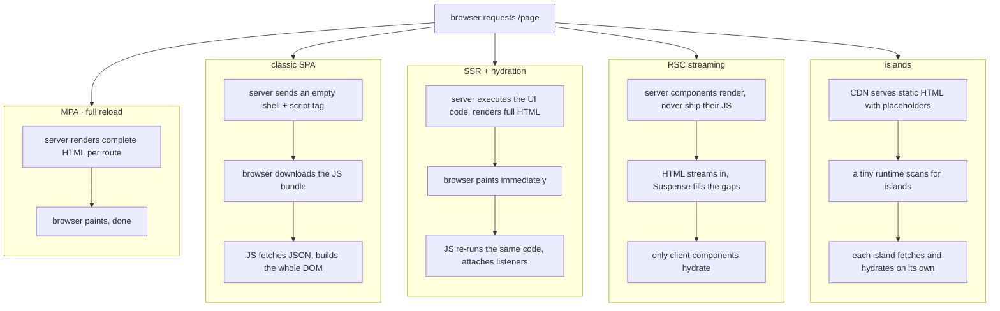

<Lede>
A while back I got handed a marketing site to "just fix the performance." Lighthouse gave it a 31. The homepage was a blank white rectangle for close to three seconds before a single word of copy showed up, and it was, of course, mostly copy: a headline, some pricing cards, a contact form. Nothing that needed a client-side JavaScript framework to exist. It was a plain Create-React-App-era SPA, shipping an empty <code>&lt;div id="root"&gt;</code> and a JS bundle that had to load, parse, and run before the page became anything at all. Fixing it meant explaining, to a team that had never questioned the default, that "send JavaScript and let it build the page" is <em>one</em> way to render a website, not the only one. This post is that explanation, expanded to the whole spectrum: what each rendering strategy actually does on the wire, why the next one was invented to fix the last one's specific pain, and which one you should reach for.
</Lede>

<Toc />

<Figure caption="The same request, five different ways of turning it into pixels. Read top to bottom: who does the work, and when the browser gets to paint.">

</Figure>

## the plain HTML era, and why it never actually died

Start at the bottom, because that's where the web started. In a Multi-Page Application, every navigation is a full round trip: the browser asks for `/about`, the server (Flask with Jinja2, PHP, Rails, whatever) builds a complete HTML document and sends the whole thing back, and the browser throws away the old page and paints the new one from scratch.

This is not a legacy pattern you tolerate. For content-heavy pages, it's close to optimal. Crawlers get full HTML on the first request, there's no JavaScript required to see anything, and the architecture is boring in the good way: one request in, one document out. The cost is the one everyone feels immediately, the full-page reload. Click a link and the whole screen goes white for a beat before the new page draws. No persistent audio player, no chat widget that survives navigation, because the browser genuinely reloads everything, every time.

**HTMX** is the interesting rebuttal to "so MPAs feel dated." Instead of a full reload, an element on the page fires an AJAX request that gets back an HTML *fragment*, not JSON, and swaps it into the DOM. You get SPA-flavored partial updates without shipping a client-side framework or a virtual DOM. It's the same MPA philosophy, just with a scalpel instead of a full page swap.

## the SPA swing, and the waterfall it hides

The rise of capable client-side JavaScript pushed things the other direction, hard. In a Single-Page Application, the server's job shrinks to almost nothing: send a near-empty HTML skeleton with a `<script>` tag, and let the browser do the rest. React, Vue, Angular, all without server rendering, work this way by default.

Here's the part that bit my client. The browser has to download the HTML shell, then fetch the JS bundle, then execute it, and only *then* does the app start fetching the JSON data it needs to render anything. That's a genuine waterfall: HTML → JS → data → paint, each stage blocked on the last. Once it's loaded, an SPA feels fantastic, instant client-side navigation, no reload jank, easy to keep a video player or a chat window alive across routes. But that first load is the SPA's whole tax bill, paid up front, and it shows up exactly where mine did: a blank screen while a several-hundred-kilobyte bundle does its thing, and historically, awful SEO, because crawlers used to just see an empty div.

## bridging back: SSR pays down the blank-screen debt, but not for free

Server-Side Rendering exists specifically to kill that blank screen. The trick: run the *same* application code on a server-side JS runtime (Node, via Next.js's older Pages router, Nuxt, SvelteKit) for the initial request, so the server produces full HTML immediately, the same way an MPA would. The browser paints real content right away. Then, once the JS bundle arrives, it "hydrates": re-runs the identical component code against the HTML that's already sitting there, attaching event listeners so the page becomes interactive.

That word "hydrates" is doing a lot of work, and it's where the real cost of SSR lives. The content gets sent *twice*: once as rendered HTML, and again as the data or logic the client needs to re-derive that same UI so it can attach behavior to it. That's the double-data problem, and it's why an SSR page can look ready instantly but not actually respond to a click for another second or two, if you tap a button before hydration finishes, nothing happens. You've traded "blank screen" for "uncanny valley screen." Better trade, still a trade. And you now need a Node server running your app code in production, not just a folder of static files, which is its own operational line item.

<Note title="what changes on navigation, specifically">
With the Next.js Pages router, clicking a link doesn't reload the page, but it does trigger an API call back to the server for a JSON data blob for the new route. The client renders from that. It's faster than a full MPA reload, but it can still visibly block on that round trip.
</Note>

## the modern hybrid: server components stop shipping their own JS

React Server Components, as adopted by Next.js's App directory, are the answer to "why are we hydrating things that never needed to be interactive in the first place." An RSC renders *only* on the server, produces HTML, and its JavaScript never ships to the client at all. Full stop. If a component just displays data, there's no reason its code needs to exist in the browser, and now it doesn't.

The other half of this is streaming. Components wrapped in `Suspense` can arrive later, so the server sends the parts of the page that are ready immediately and fills in the slow parts (a data-heavy widget, say) as they finish, instead of holding the entire response hostage to the slowest query. On navigation, instead of a full reload or even a JSON round trip, the client shows a Suspense loading state instantly and fetches just the HTML chunks that changed, streaming them in as they're ready.

I like this one a lot, for what it's worth. It's the first strategy in the list that actually reduces the amount of JavaScript shipped, rather than just moving around *when* it arrives. The cost is real too: your app now runs across two genuinely different execution environments, and debugging "why did this component render twice, once on the server and once somewhere I didn't expect" is a new category of bug that MPA-era developers never had to think about. You also need infrastructure sophisticated enough to handle streaming and edge caching, which is why this pattern is basically synonymous with deploying to Vercel or a similar edge platform.

## the other answer: islands, or don't hydrate what doesn't move

Islands architecture, the Astro model, comes at the same problem from the opposite direction. Instead of asking "how do we make the server smarter," it asks "why are we hydrating the whole page when 90% of it is static text?" A CDN serves a page that's almost entirely plain, pre-rendered HTML. Scattered through it are a handful of placeholders, the "islands", for the bits that actually need interactivity: a cart widget, a carousel, a like button. A small runtime script scans for these islands and fetches and hydrates *only* those, each independently.

The initial load is about as fast as a static site gets, because most of the page really is a static site. JavaScript ships only for the parts that need it, which sidesteps the "over-hydration" problem SSR has, where a fully interactive React tree gets rehydrated even for the paragraphs that will never do anything. The tradeoff is a genuine mental shift: you have to think about your UI as static regions and interactive islands from the start, not as one uniform component tree, and an island's content won't appear until its own small fetch completes, so you'll see a beat of loading state exactly where the island sits.

## picking one: a decision guide, not a ranking

None of these five replaced the one before it. They coexist because they solve different problems.

<Checklist title="use this rendering strategy when...">
- [ ] Content-heavy, low-interactivity, SEO matters most → **MPA** (Flask/Jinja2, plain HTML), reach for **HTMX** the moment you want partial updates without a full framework
- [ ] Internal tool or dashboard where the first load doesn't matter but every subsequent interaction should feel instant → **classic SPA**
- [ ] Public-facing app that needs good SEO and a fast first paint, and you're fine running a Node server → **SSR** (Next.js Pages, Nuxt, SvelteKit)
- [ ] Same needs as SSR, but you also want to cut client JS and stream slow data in piecemeal → **RSC** (Next.js App Router, Remix), if you're already committed to an edge-capable host
- [ ] Mostly static content with a few genuinely interactive widgets sprinkled in → **islands** (Astro), when you want the smallest possible JS payload
</Checklist>

**Bottom line:** every one of these strategies is a different answer to the same question, who does the rendering work and when does the browser get to paint, and the "right" one is whichever one matches how much of your page is actually static versus actually interactive. The client site I opened with didn't need SSR, RSC, or islands. It needed someone to notice that a brochure page with a contact form doesn't need a client-side JavaScript framework rendering it from an empty div, and switching it to plain server-rendered HTML took the Lighthouse score from 31 to the 90s in an afternoon.

Pick based on what your page actually is, not what's trendy this year, and you'll rarely be wrong.
