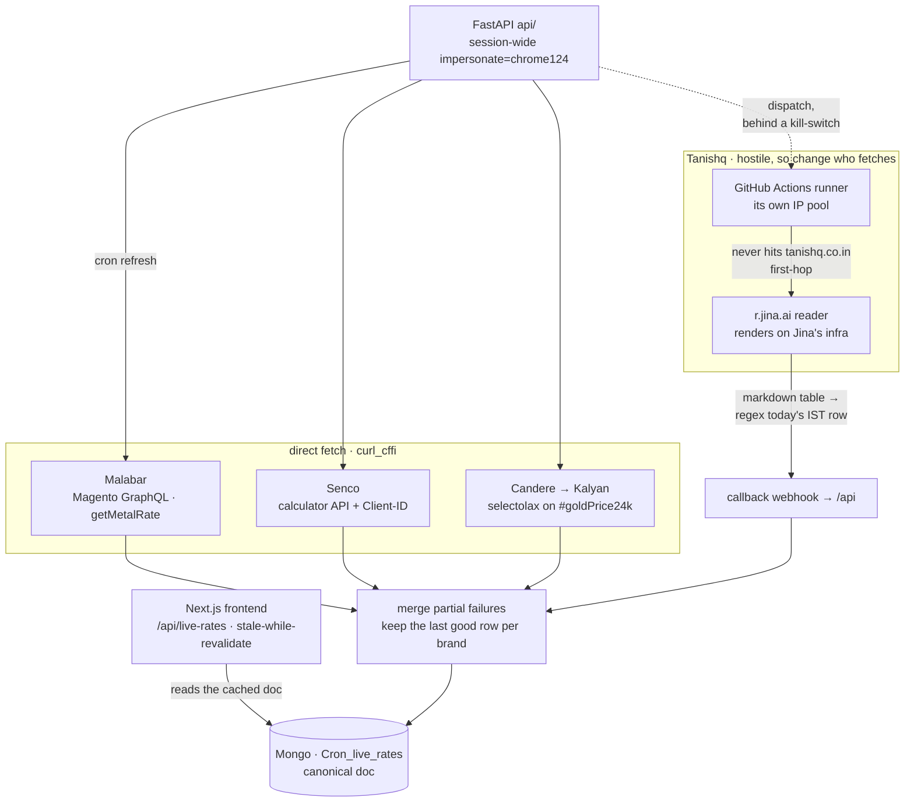

<Lede>
A while back my friend <a href="https://github.com/Amreshhh">Amresh</a> was building <a href="https://pitaara.vercel.app/">Pitaara</a>, a live gold-rates app that tracks prices across big Indian jewellery brands like Tanishq, Malabar, Senco and Candere. The catch: none of these brands offer an API, and all of them sit behind serious bot protection. I've done my fair share of scraping before, so I jumped in to help. And here's the thing we kept coming back to: <em>these scrapers mostly avoid the fight entirely</em>. No browser farms, no captcha solvers. Just TLS impersonation, the internal JSON these sites already ship to their own frontends, and one very cheeky GitHub Actions trick.
</Lede>

This post is two things at once: a walkthrough of how [Pitaara](https://pitaara.vercel.app/) works, and the practical "how to scrape websites in 2026" guide I wish someone had handed me earlier: what to use when, what breaks, and how to get unblocked.

<Note title="Quick reality check">
Scraping can violate a site's terms of service. The point of this post is understanding how detection layers work and how the web actually fits together, which is useful whether you're pulling data or defending it. Be polite: cache aggressively, respect rate limits, don't hammer origins.
</Note>

<Toc />

## the project, in one screen

First, what we built. [Pitaara](https://pitaara.vercel.app/) is a FastAPI + Next.js app that serves live gold rates (24K, 22K, 18K, 14K prices per brand) plus an offline-harvested product catalog for making-charge comparisons. The live path is basically three files: `api/live_rates.py`, `api/tanishq_fetcher.py`, `api/main.py`.

<Figure caption="Pitaara's live-rate path: FastAPI scrapes three brands directly with curl_cffi, Tanishq gets fetched off-box through GitHub Actions and Jina Reader, and everything merges into one canonical Mongo doc.">



</Figure>

Every row in this table was a "challenge faced → overcome" story, so consider it the trailer for the rest of the post:

| Brand    | Surface                                        | What we did                                                             | Parse                              |
| -------- | ---------------------------------------------- | ----------------------------------------------------------------------- | ---------------------------------- |
| Malabar  | `/graphql-magento?query=getMetalRate…`         | curl_cffi session hitting the Magento GraphQL the SPA already uses      | JSON → purity map                  |
| Senco    | `api.sencogoldanddiamonds.com/calculator/list` | TLS impersonation + full Chrome headers + the `Client-ID` from their frontend bundle | JSON `GOLD[]`        |
| Candere → Kalyan | `candere.com/gold-rate-today/india`    | curl_cffi + no-cache + cache-bust query                                 | selectolax `#goldPrice24k`, derive 22/18/14K |
| Tanishq  | gold-rate page (hostile)                       | Jina Reader + GitHub Actions isolation, full story below                | Markdown table regex for today's IST date |

Now the guide part. Each section is a challenge you'll hit scraping anything non-trivial, in the order you'll hit them.

## challenge 0: "this website doesn't have an api" (yes it does)

This is the single biggest mindset shift, so it goes first. People look for a public API, find none, and conclude they need to parse HTML. Wrong instinct, man.

**If a site is a modern React/Next/Vue app, it has an API, it's just "internal."** The SPA in your browser has to get its data from somewhere, and that somewhere is almost always clean JSON: GraphQL resolvers, REST calculator endpoints, third-party search SaaS, or a hydration blob serialized into the page. The frontend bundle even ships the API keys it uses.

So step zero of scraping anything, before writing a single selector:

<Steps>
<Step title="Open DevTools → Network → XHR/Fetch">
Use the site like a normal human for a minute. Filter for XHR/Fetch. Watch what the SPA calls when prices load, when you paginate, when you search.
</Step>
<Step title="Identify the JSON the page already consumes">
For Malabar this was a Magento GraphQL endpoint (<code>getMetalRate</code>). For Senco, a calculator API. For catalog pages, a Klevu search SaaS. For Next.js product pages, the <code>#__NEXT_DATA__</code> script tag, holding the entire price breakup, pre-serialized for hydration.
</Step>
<Step title="Lift the auth-ish bits from the frontend">
Client-IDs, embedded <code>apiKeys</code>, short-lived cookies: copy them from the browser once and reuse. Senco's <code>Client-ID</code> UUID came straight out of their JS bundle.
</Step>
<Step title="Only then consider HTML parsing">
If there's genuinely no JSON (rare), fine, parse HTML, but with something fast like <code>selectolax</code>, not a browser. One DOM node (<code>#goldPrice24k</code>) gave us 24K, and 22/18/14K are just purity ratios away.
</Step>
</Steps>

Why this works so well: internal APIs are built for the site's own frontend, so they're structured, paginated, and, crucially, hitting them looks *way* less bot-like than replaying 200 infinite-scroll clicks. You're indistinguishable from the SPA except at the network layer. Which brings us to the next challenge.

## challenge 1: the TLS handshake snitches on you

So you point Python at the endpoint you found... and instantly get 403'd, even with a browser `User-Agent`. Welcome to the lesson that costs everyone a few hours: **matching the UA is cargo cult; the TLS handshake betrays you first.**

<Panel title="JA3, in one breath" tone="accent" icon="fingerprint">
A JA3/JA4 hash fingerprints your TLS ClientHello: TLS version, cipher list, extensions, curves, point formats. Chrome and Python's OpenSSL produce completely different hashes <em>even when the User-Agent lies</em>. You showed up to the costume party with the right mask and the wrong body.
</Panel>

The fix is [`curl_cffi`](https://github.com/lexiforest/curl_cffi): a Python wrapper around a patched libcurl that bypasses Python's `ssl` module entirely and rewrites the ClientHello *and* header order to match a real browser. It's the 80% tool of this whole guide, at 100–500 req/s in a few tens of MB of RAM, no JavaScript engine, pure protocol impersonation.

```python
from curl_cffi.requests import AsyncSession

async with AsyncSession(impersonate="chrome124") as session:
    r = await session.get(
        "https://api.example.com/rates?_ts=…",
        headers={
            "User-Agent": "Mozilla/5.0 … Chrome/124.0.0.0 …",
            "Sec-Ch-Ua": '"Chromium";v="124", "Google Chrome";v="124", "Not-A.Brand";v="99"',
            "Origin": "https://example.com",
            "Referer": "https://example.com/",
            # + whatever Client-ID / API key the SPA already embeds
        },
        timeout=15,
    )
    data = r.json()
```

Two details that matter more than they look: set impersonation **session-wide** so every request matches, and match your UA's major version to the profile. `chrome124` in the TLS hello plus `Chrome/90` in the UA is exactly the kind of contradiction a WAF eats for breakfast.

## challenge 2: the WAF wants the full costume

TLS got you past the door; now the application-layer WAF checks the details. For Senco's calculator API, we aligned every signal so nothing contradicts anything else. There's a comment in the code that literally says *"Perfect WAF Bypass Headers matching Chrome 124"*, which, fair:

- `Sec-Ch-Ua`, `Sec-Ch-Ua-Mobile`, `Sec-Ch-Ua-Platform`
- `Origin` and `Referer` telling a same-site story
- `Sec-Fetch-Site: same-site`, `Sec-Fetch-Mode: cors`
- the `Client-ID` UUID the real SPA sends
- session-level `impersonate="chrome124"` so TLS matches the UA

That last bullet is the one people skip, yk. Perfect headers, then the TLS hello announces "hi, I'm CPython."

Also in the "boring but load-bearing" category: CDNs cache rates, so we add `?_ts=unix` cache-bust params and no-cache headers, or you'll serve yesterday's gold price with full confidence.

## challenge 3: tanishq actually fought back

Tanishq blocked automated access hard enough that curl_cffi from our server IP wasn't viable. This is where most people reach for Playwright. We did something I'm much prouder of: **we just weren't there when the fetch happened.**

<Steps>
<Step title="Jina AI Reader as a fetch proxy">
The fetcher never hits <code>tanishq.co.in</code> first-hop. It requests:

```text
https://r.jina.ai/https://www.tanishq.co.in/gold-rate.html?lang=en_IN&_ts=…
```

Jina fetches and renders the page from *their* infra and returns clean markdown. We regex today's IST date row out of the rate-history table. You inherit Jina's IP reputation and render path without running a single Chromium process yourself.
</Step>
<Step title="GitHub Actions as IP isolation">
A scheduled workflow runs a tiny script on <code>ubuntu-latest</code> with its own <code>AsyncSession(impersonate="chrome124")</code>, then POSTs results to a callback URL on the main API. Different IP pool than the Vercel host, no serverless timeout risk, the main API stays thin, and there's an <code>ENABLE_GITHUB_TANISHQ_DISPATCH</code> kill-switch, which is the kind of paranoia I aspire to.
</Step>
<Step title="Normalize, then derive the karat ladder">
Scraped 22K gets normalized with digit-length heuristics (per-gram vs per-10g, because jewellers can never agree on units), then 24/18/14K are derived by purity ratios.
</Step>
</Steps>

The lesson generalizes: when one origin is hostile, treat it as a **systems problem**, not a regex problem. Change *who* fetches (GHA), *through what* (Jina), and *how the TLS looks* (curl_cffi). The blocked HTML was never the real problem.

## challenge 4: doing it at catalog scale

Live rates are the flashy part; the catalog harvesters (`backend/fetch_prod_*`) are where scale discipline shows up. Same philosophy, **search APIs over HTML grids**, plus concurrency with semaphores and Mongo resume so a crash never means starting over:

| Script family  | Trick                                                                                     | Stealth detail                                                        |
| -------------- | ----------------------------------------------------------------------------------------- | --------------------------------------------------------------------- |
| Candere / Kalyan Klevu | POST to Klevu's search endpoint with the `apiKeys` lifted from the frontend bundle; micro-category terms; offset pagination | `impersonate="chrome110"`, 0.3s sleep, SKU dedupe |
| Senco deep dive | GET product URL → parse the `#__NEXT_DATA__` hydration JSON for the making-charge breakup | `impersonate="chrome120"`, concurrency 30, bail if the body says "cloudflare / just a moment" |
| Malabar bulk   | Product JSON / breakup endpoints with storefront Origin/Referer                           | Semaphore 50, Mongo SKU auto-resume                                   |

And the ops patterns that keep any scraper alive longer than a week: **never scrape on every pageview** (Mongo holds the canonical doc, a cron refreshes it), merge partial failures (keep the last good row when one brand 403s), stale-while-revalidate on the frontend, retries with backoff. The scraping code is honestly only half the project. The other half is not being stupid about *when* you scrape.

## what to use when: the escalation ladder

Compressing everything above into one rule: **start cheap, escalate only when blocked.**

<Steps>
<Step title="L0: find a softer source">
Official APIs, RSS, open data, or just a site that isn't defended. Fun fact: Amresh's earlier repo, <a href="https://github.com/Amreshhh/Gold-App">Gold-App</a>, took this to the extreme: it scraped third-party blogs that had already aggregated making-charge info, and let <strong>Gemini</strong> structure the messy HTML into JSON with Pydantic validation. Zero bot fights, works because soft targets barely run bot protection, and the LLM absorbs layout churn. Staler data, but a brilliant v1 in its laziness.
</Step>
<Step title="L1: reuse the SPA's own JSON">
GraphQL, calculator APIs, Klevu search, <code>__NEXT_DATA__</code>. Pull Client-IDs and apiKeys from the frontend bundle once and reuse them. This covers most modern sites, because modern sites are SPAs.
</Step>
<Step title="L2: curl_cffi impersonation">
Session-wide <code>impersonate</code>, matching UA major version, full header suite, cache-bust params, polite concurrency. Handles ~90% of what's left.
</Step>
<Step title="L3: change egress / proxy the fetch">
Jina Reader, GitHub Actions cron, residential proxies, a different cloud region. Pitaara's Tanishq path lives here.
</Step>
<Step title="L4: real browser / challenge solver">
DrissionPage, Playwright stealth, or FlareSolverr as a self-hosted solver microservice. Paid captcha solvers as the absolute last resort. Notably: <em>not used anywhere in Pitaara's live path</em>, because we engineered around it.
</Step>
</Steps>

| Tool                      | Layer           | JS?          | ~req/s  | RAM            | Use                         |
| ------------------------- | --------------- | ------------ | ------- | -------------- | --------------------------- |
| `curl_cffi`               | TLS / HTTP      | No           | 100–500 | 20–50 MB       | the default                 |
| `got-scraping` / cycle-tls | TLS / HTTP     | No           | 80–400  | 30–60 MB       | Node equivalent             |
| `selectolax`              | Parse           | N/A          | n/a     | tiny           | DOM IDs, tables             |
| `chompjs`                 | Parse           | N/A          | n/a     | tiny           | JS object → dict            |
| Jina Reader               | Proxy render    | Yes (remote) | low     | 0 local        | hostile pages               |
| DrissionPage / Playwright | Browser CDP     | Yes          | 2–10    | 200–600 MB/tab | hard JS walls               |
| FlareSolverr              | Solver proxy    | Yes          | 1–5     | 0.5–1 GB       | self-hosted CF solver       |
| Selenium                  | WebDriver       | Yes          | 1–3     | high           | legacy; easy to detect      |
| httpx + LLM               | Soft HTML + AI  | No           | low     | API cost       | avoiding hard origins       |

<Kpi cols={3}>
<Stat value="100–500" label="req/s with curl_cffi" tone="ok" />
<Stat value="2–10" label="req/s with a real browser" tone="warn" />
<Stat value="0" label="browsers opened in prod" tone="accent" />
</Kpi>

## the playbook

If you take nothing else, take this checklist:

<Checklist title="Before you scrape anything">
- [ ] Open DevTools Network on the real site, and find the JSON/XHR the SPA already calls
- [ ] Remember: "no public API" ≠ no API, because modern React apps must talk to something
- [ ] Copy the auth-ish headers (Client-ID, apiKeys, short-lived cookies) from the browser
- [ ] Fetch with curl_cffi + a matching impersonate major version
- [ ] Parse JSON / __NEXT_DATA__ / selectolax, not a full browser render
- [ ] Cache results (Mongo / Redis), and never scrape on every UI hit
- [ ] On 403/challenge: change egress (Jina, GHA, residential) before reaching for Playwright
- [ ] Still blocked: stealth browser or FlareSolverr microservice, keep the primary path thin
- [ ] Respect rate limits and ToS; don't burn residential IPs on wasteful loops
</Checklist>

<InkBand title="bottom line">
Pitaara works because it impersonates Chrome at the socket, talks to the same APIs the websites themselves use, and for the one hostile origin, moves the fetch off-box through Jina + GitHub Actions. "No API" almost always means "no <em>documented</em> API"; the SPA's own JSON is sitting right there. <code>curl_cffi</code> is the 80% tool; browsers are the sledgehammer. Reach for the sledgehammer last.
</InkBand>

## credits & sources

- [Pitaara, live app](https://pitaara.vercel.app/) · [repo](https://github.com/Amreshhh/Pitaara), built by [Amresh](https://github.com/Amreshhh) ([LinkedIn](https://www.linkedin.com/in/amreshhh/)), scraping architecture jointly figured out over many "why is this 403ing" calls
- [Gold-App](https://github.com/Amreshhh/Gold-App), the earlier, lazier (affectionate) version
- [lexiforest/curl_cffi](https://github.com/lexiforest/curl_cffi), the library doing all the TLS heavy lifting
- Jina Reader: `https://r.jina.ai/https://…`
- Adjacent tooling worth knowing: FlareSolverr, DrissionPage, got-scraping, chompjs

<Hand>
shoutout to Amresh for letting me write this up. go poke around pitaara.vercel.app, the rates are live.
</Hand>
