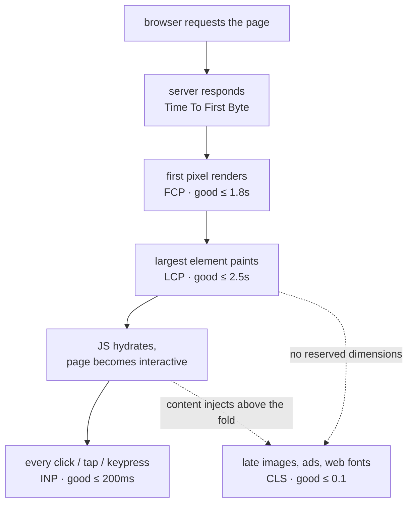

<Lede>
I redeployed my portfolio after a redesign, opened it on my laptop over wifi, and it felt snappy, so I moved on. A few days later I ran it through PageSpeed Insights out of habit, the kind of check you do right before you forget to, and the largest-contentful-paint number came back somewhere north of 4 seconds on simulated mobile. Same site. My machine had lied to me, the way a fast dev connection always does. That sent me down a real audit of Core Web Vitals across the stack I actually build with: FastAPI on the backend, Next.js and Astro on the frontend, plain React components in between.
</Lede>

This is that audit, written up properly: what each metric measures, where it actually breaks in a full-stack app, and the code that fixed it, not the theory.

<Toc />

## the whole shape of a page load

Before the metric-by-metric walkthrough, here's where each one sits on the timeline of a single page load, and where the failure modes creep in:

<Figure caption="One page load, four checkpoints. LCP and hydration are also the two places a late-arriving element can shove everything else around and rack up CLS.">



</Figure>

Three of those checkpoints are the official Core Web Vitals: LCP for loading, INP for responsiveness, CLS for stability. FCP and TTFB aren't official Vitals anymore, but they're upstream of LCP, so ignoring them just means guessing at why LCP is slow.

## first contentful paint: proving something's happening

FCP is the moment a user sees *anything*, not the final layout, just proof the page isn't dead. Google's guideline is under 1.8 seconds for "good," and the fix is almost entirely a backend problem: get bytes to the browser fast, and don't make the first paint wait on anything it doesn't need.

```python
from fastapi import FastAPI
from fastapi.middleware.gzip import GZipMiddleware
from fastapi.responses import HTMLResponse

app = FastAPI()
app.add_middleware(GZipMiddleware, minimum_size=1000)

@app.get("/", response_class=HTMLResponse)
async def home():
    # send the shell immediately, critical CSS inlined, everything else deferred
    return """
    <!DOCTYPE html>
    <html>
    <head>
        <style>
            .hero { font-size: 2rem; padding: 2rem; }
        </style>
    </head>
    <body>
        <div class="hero">Welcome to tashif.codes</div>
        <link rel="stylesheet" href="/styles.css" media="print"
              onload="this.media='all'">
    </body>
    </html>
    """
```

<Tip title="The one rule that matters here">
Inline the critical CSS for the above-the-fold content, and load everything else as if it's optional, because for this specific measurement it is.
</Tip>

## largest contentful paint: the one that actually gates rankings

LCP is usually a hero image, a big headline, or a video poster frame. On my portfolio it's the hero image, and if that takes 4 seconds to show up, that's the number PageSpeed reports, full stop, well past Google's 2.5-second "good" threshold.

<Tabs>
<Tab title="Next.js">

```tsx
import Image from "next/image";

export default function Hero() {
  return (
    <section className="hero">
      <Image
        src="/portfolio-hero.webp"
        alt="Tashif's Portfolio"
        width={1200}
        height={600}
        priority // preload this, it's the LCP candidate
        placeholder="blur"
        blurDataURL="data:image/jpeg;base64,..."
        sizes="100vw"
      />
      <h1>Welcome to tashif.codes</h1>
    </section>
  );
}
```

`priority` tells Next.js to preload the image instead of lazy-loading it, which matters because the default lazy behavior is exactly wrong for whatever renders as your LCP element. The blur placeholder gives the browser something to paint while the real file streams in.

</Tab>
<Tab title="Astro">

```astro
---
import { Image } from 'astro:assets';
import heroImage from '../assets/hero.webp';
---

<section class="hero">
  <Image
    src={heroImage}
    alt="Portfolio Hero"
    width={1200}
    height={600}
    loading="eager"
    decoding="async"
    quality={85}
  />
  <h1>Welcome to tashif.codes</h1>
</section>

<style>
  .hero {
    contain: layout style paint;
  }
</style>
```

Astro optimizes images at build time and generates the right formats and sizes without a runtime image service. `loading="eager"` is the equivalent of Next's `priority`: don't lazy-load the thing the metric is measuring.

</Tab>
</Tabs>

The pattern is identical across frameworks even though the API differs: find the actual LCP element with DevTools' Performance panel, then make sure that one specific element is exempt from every lazy-loading default you've set up for everything else.

## interaction to next paint: every click counts now

INP replaced First Input Delay as the responsiveness metric a while back, and the difference matters: FID only measured the *first* interaction. INP measures the worst one across the entire page lifecycle, clicks, taps, keypresses, all of it. Good is under 200ms.

```javascript
import { useCallback, useMemo, startTransition } from "react";

function ProjectGallery({ projects }) {
  const [filter, setFilter] = useState("all");
  const [searchTerm, setSearchTerm] = useState("");

  const filteredProjects = useMemo(() => {
    return projects.filter((p) => {
      const matchesFilter = filter === "all" || p.category === filter;
      const matchesSearch = p.title.toLowerCase().includes(searchTerm);
      return matchesFilter && matchesSearch;
    });
  }, [projects, filter, searchTerm]);

  // non-urgent update: let React deprioritize this behind anything more urgent
  const handleFilter = useCallback((newFilter) => {
    startTransition(() => {
      setFilter(newFilter);
    });
  }, []);

  const debouncedSearch = useMemo(
    () => debounce((term) => setSearchTerm(term), 300),
    []
  );

  return (
    <div>
      <input
        onChange={(e) => debouncedSearch(e.target.value)}
        placeholder="Search projects..."
      />
      <div className="filters">
        {["all", "web", "mobile", "design"].map((cat) => (
          <button key={cat} onClick={() => handleFilter(cat)}>
            {cat}
          </button>
        ))}
      </div>
      <div className="grid">
        {filteredProjects.map((project) => (
          <ProjectCard key={project.id} {...project} />
        ))}
      </div>
    </div>
  );
}
```

`useMemo` keeps the filter from re-running the whole list on every render, `startTransition` tells React the filter update can wait behind anything the user is actually mid-typing, and the debounce keeps a fast typist from triggering a re-filter on every keystroke. None of this is exotic; it's just the three things that actually show up in a Performance trace when a click feels laggy.

## cumulative layout shift: the rage-inducing one

CLS is the metric everyone recognizes before they know its name: you're about to tap something, an ad or an image finishes loading above it, and you tap the wrong thing. Good is under 0.1.

```css
.image-container {
  aspect-ratio: 16 / 9;
  background: linear-gradient(90deg, #f0f0f0 25%, #e0e0e0 50%, #f0f0f0 75%);
  background-size: 200% 100%;
  animation: shimmer 1.5s infinite;
}

@keyframes shimmer {
  0% {
    background-position: 200% 0;
  }
  100% {
    background-position: -200% 0;
  }
}

.dynamic-content {
  min-height: 300px;
  display: flex;
  align-items: center;
  justify-content: center;
}

img,
video {
  width: 100%;
  height: auto;
}

@font-face {
  font-family: "MyFont";
  src: url("/fonts/myfont.woff2") format("woff2");
  font-display: swap;
  size-adjust: 100%;
}
```

<Panel title="What actually prevents CLS" tone="ok">
Specify width and height (or `aspect-ratio`) on every image and video. Reserve space for anything that loads in dynamically, with a real min-height, not a hope. Use a skeleton or shimmer placeholder instead of nothing. Set `font-display: swap` and tune `size-adjust` so a webfont swap doesn't reflow the line height. And don't insert content above what the user is already looking at unless they asked for it.
</Panel>

## what actually moved the needle across frameworks

<Tabs>
<Tab title="Next.js">

```javascript
// next.config.js
module.exports = {
  images: {
    remotePatterns: [{ protocol: "https", hostname: "tashif.codes" }],
    formats: ["image/webp", "image/avif"],
    deviceSizes: [640, 750, 828, 1080, 1200, 1920],
  },
  experimental: {
    optimizeCss: true,
  },
  compiler: {
    removeConsole: process.env.NODE_ENV === "production",
  },
};
```

Automatic code splitting, image optimization, `next/font` for webfont loading without a layout shift, and static optimization where the page allows it. Most of the win here is just not turning any of it off.

</Tab>
<Tab title="Astro">

```astro
---
import HeavyChart from '../components/HeavyChart';
import ContactForm from '../components/ContactForm';
---

<Layout title="Dashboard">
  <header>
    <h1>Performance Dashboard</h1>
  </header>

  <HeavyChart client:visible />
  <ContactForm client:idle />
  <InteractiveDemo client:click />
</Layout>
```

The part I actually like about Astro's island model: zero JavaScript ships by default, and each interactive component picks its own hydration trigger. A chart below the fold doesn't cost you anything until it's visible. A contact form doesn't cost you anything until the browser is idle. That's a direct lever on INP and on total bytes shipped, not a side effect of some other optimization.

</Tab>
<Tab title="FastAPI">

```python
from fastapi import FastAPI
from fastapi.responses import StreamingResponse
from functools import lru_cache
import json

app = FastAPI()

@app.get("/api/portfolio")
async def portfolio_data():
    async def generate():
        critical = await get_critical_projects()
        yield f"data: {json.dumps({'critical': critical})}\n\n"
        additional = await get_additional_projects()
        yield f"data: {json.dumps({'additional': additional})}\n\n"

    return StreamingResponse(generate(), media_type="text/event-stream")

@lru_cache(maxsize=128)
async def get_cached_projects(category: str):
    return await db.fetch_projects(category)
```

Streaming the critical data first and the rest after means the frontend can paint something real before the whole payload is ready, which is the same principle as inlining critical CSS, just applied to an API response instead of HTML.

</Tab>
</Tabs>

## measuring it for real

None of the above matters if you can't tell whether it worked, so here's what actually ships to the browser on my site:

```javascript
// web-vitals.js
import { onCLS, onINP, onFCP, onLCP, onTTFB } from "web-vitals";

function sendToAnalytics(metric) {
  const body = JSON.stringify({
    name: metric.name,
    value: metric.value,
    rating: metric.rating,
    delta: metric.delta,
    id: metric.id,
    navigationType: metric.navigationType,
  });

  if (navigator.sendBeacon) {
    navigator.sendBeacon("/api/vitals", body);
  } else {
    fetch("/api/vitals", { method: "POST", body, keepalive: true });
  }
}

onCLS(sendToAnalytics);
onINP(sendToAnalytics);
onFCP(sendToAnalytics);
onLCP(sendToAnalytics);
onTTFB(sendToAnalytics);
```

That's real user monitoring, not a lab test, and it's the only way to catch the gap between "fast on my wifi" and "fast on someone's phone on a train." Alongside it I still run Lighthouse locally and PageSpeed Insights on the deployed URL, because lab data catches regressions before a single real user hits them, and field data catches the ones lab data misses entirely.

## the business case, in one well-worn stat

The reason this is worth the afternoon it costs to fix: Google's often-cited mobile speed research put load-time delay directly against bounce probability, and the curve is steep.

<Bars title="Increase in bounce probability, by page load time">
<Bar label="1 to 3 seconds" value={32} max={123} display="+32%" tone="ok" />
<Bar label="1 to 5 seconds" value={90} max={123} display="+90%" tone="warn" />
<Bar label="1 to 10 seconds" value={123} max={123} display="+123%" tone="danger" />
</Bars>

For a portfolio site that's the difference between a recruiter finishing the scroll or bouncing before the second project loads. For anything with a checkout or a signup form behind it, the same curve is the difference in revenue.

## the checklist

<Checklist title="before you ship the next build">
- [ ] Run Lighthouse locally, then PageSpeed Insights on the actual deployed URL, not localhost
- [ ] Find the real LCP element in DevTools and exempt it from any lazy-loading default
- [ ] Inline critical CSS, defer the rest, don't block first paint on anything optional
- [ ] Profile the worst interaction, not the first one, useMemo/startTransition/debounce where it's actually slow
- [ ] Every image and video has width/height or aspect-ratio, no exceptions
- [ ] Reserve space for anything that loads in late, with a real min-height
- [ ] Ship web-vitals.js to production and actually look at the field data
- [ ] Re-check on a throttled connection, not the wifi you built it on
</Checklist>

**Bottom line:** Core Web Vitals aren't one team's problem. FCP and LCP are mostly a backend and asset-delivery question, INP is mostly a frontend rendering question, and CLS is a discipline question that touches both. The fix for each one is small and specific once you've found the actual offending element, the hard part is that your own dev machine will never show you the problem, because it's never the bottleneck. Test on the connection your users actually have.

<Hand>
run Lighthouse on whatever you shipped today, not the one from last sprint.
</Hand>
