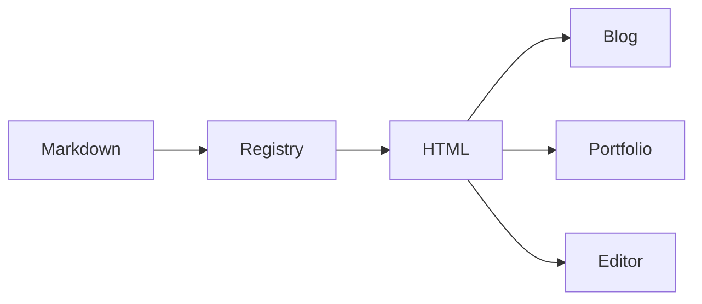

<Lede>
A `<Panel>` rendered clean on the blog and came out as a bare, unstyled `<div>`
on the portfolio. Same Markdown file, same post, two different renders,
because one site was a version behind on the shared renderer package. That's
the actual bug that made this page necessary: one post that exercises every
component in the registry, tag spelling and directive spelling both, so a
drift like that shows up here, in public, before a reader ever sees it.
</Lede>

<Toc />

That list above is the registry in one screen: layout, structure, data,
marginalia, media, tabs, and two spellings for every one of them. Everything
under a heading below has its own live demo.

## why components at all {#why}

Plain Markdown gets you prose, lists, tables, code. Fine for a tutorial. Not
enough for a plan, a comparison, or a postmortem, the kind of document that
wants structure the reader can *see* instead of infer from paragraph breaks.

So the renderer adds a closed set of components on top of that. Not MDX.
Nothing gets imported, nothing gets evaluated, on purpose. A tag either
resolves against the registry or it just sits there as ordinary HTML. That
constraint is the whole point: it's what lets a post travel over the API as a
plain string and still render the same way on three different sites.

<Note title="Two spellings, one result">
Everything here can be written as a tag (`<Steps>`) or as a directive
(`:::steps`). They parse to the same tokens. Tags nest more legibly; directives
survive being read on GitHub, where an unknown tag would simply vanish.
</Note>

## layout {#layout}

### columns

<Cols ratio="2:1">
<Col>
The wide column takes the argument, and the narrow one takes the aside. That
break point is about 34rem of *container* width, not viewport, since posts
render inside resizable windows. Below it the columns stack and a rule appears
between them.

Anything works in here: lists, code, even another component.
</Col>
<Col>
<Panel title="Note to self" tone="muted">
Equal columns: `<Cols cols={2|3|4}>`. Unequal tracks: `ratio` values such as
`1:1`, `2:1`, `1:2`, `1:1:1`, `2:1:1`, `1:1:1:1`. Unknown ratios fall back to
equal columns and fail the publish check.
</Panel>
</Col>
</Cols>

Three equal columns, the layout behind the feature cards:

<Cols cols={3}>
<Col>
<Panel title="Input Modality" icon="arrow-down-left">
- PDF, images (JPG, PNG)
- Single image ≤ 10MB, PDF ≤ 50MB
- Maximum support: 100 pages
</Panel>
</Col>
<Col>
<Panel title="Output Modality" icon="arrow-up-right">
Text / Image Links / MD Documents
</Panel>
</Col>
<Col>
<Panel title="Supported Language" icon="languages">
Chinese, English, French, Spanish, Russian, German, Japanese, Korean, etc.
</Panel>
</Col>
</Cols>

### panels

<Panel title="Setup" icon="settings" tape tilt={-2}>
A panel is the generic card. It takes an optional title, a Lucide-style `icon`,
a strip of masking tape, a tone, and a tilt in degrees.

The tilt is inert unless the host site opts in by setting `--md-rotate: 1`, so
the same post reads as a zine on one site and as a clean article on another.
</Panel>

<Panel title="Heads up" tone="warn" icon="alert-triangle">
Toned panels tint their border and background from the site's own palette
rather than a hardcoded hue. Icons use the same stroke geometry as Lucide's
react-icons set, so write `icon="zap"` the way you would import `Zap`.
</Panel>

Icons work standalone too, not just inside a panel title:

<Icon name="rocket" size={28} /> <Icon name="sparkles" /> <Icon name="cpu" />

Tape works solo too, with nothing under it, pure decoration:

<Tape rotate={-6} />

### ink band

<InkBand title="House rules">
An inverted section, for a break in the page. Everything inside follows the
inverted colour rather than the page's, including [links](#layout) and `code`.
</InkBand>

### strips

<Strips>
- Each list item becomes its own card
- With a small alternating nudge, where tilt is enabled
- Good for a set of short, unordered points
</Strips>

## document structure {#structure}

### steps

<Steps>
<Step title="Install">
Run `bun install` and copy `.env.example` to `.env`.
</Step>
<Step title="Configure">
Set `GITHUB_TOKEN` and `EDITOR_SESSION_SECRET`. The secret must be at least 32
characters.

```bash
openssl rand -base64 32
```
</Step>
<Step title="Publish">
Numbering comes from a CSS counter, so inserting a step here would not mean
renumbering the ones below by hand.
</Step>
</Steps>

### phases

<Phases>
<Phase title="Foundation" tag="done" tone="ok">
Registry, tag syntax, validation.
</Phase>
<Phase title="Vocabulary" tag="now" tone="accent">
The components in this post.
</Phase>
<Phase title="Consumers" tag="next" tone="muted">
Blog theme, API manifest, portfolio, editor palette.
</Phase>
</Phases>

### checklist

<Checklist title="Before publish">
- [x] Directives validate
- [x] Images attached
- [ ] Cover image set
</Checklist>

### collapsible detail

<Details summary="Why not just use MDX?">
MDX compiles to JavaScript with arbitrary imports. The API serves Markdown
text, the portfolio fetches it at build time, and the editor's reading pane
renders a string. None of those can evaluate a module. A closed registry keeps
the authoring ergonomics and drops the runtime.
</Details>

## data {#data}

### headline numbers

<Kpi cols={3}>
<Stat value="34" label="components" tone="accent" />
<Stat value="290" label="tests" tone="ok" />
<Stat value="1" label="renderer" />
</Kpi>

### scored rubric

<Meters>
<Meter label="Renderer drift between sites" level="low" score={2}>
One canonical package, mirrored by a script with a `--check` mode that fails on
drift.
</Meter>
<Meter label="Python outline duplicating TS logic" level="mid" score={5}>
Contained by keeping the Python side regex-level and advisory, with a shared
fixture and a version constant asserted in both suites.
</Meter>
<Meter label="Stale mirror on a consuming site" level="high" score={7}>
The `renderer` field lets a consumer notice and warn rather than print a raw
tag into the page.
</Meter>
</Meters>

### bars

<Bars title="Where the lines went">
<Bar label="components.ts" value={720} max={900} tone="accent" />
<Bar label="markdown.css" value={820} max={900} tone="alt" />
<Bar label="validate.ts" value={330} max={900} tone="ok" />
<Bar label="jsx.ts" value={300} max={900} tone="muted" />
</Bars>

<Legend>
- Parser
- Styles
- Checks
</Legend>

## marginalia {#marginalia}

Inline components sit inside a sentence: a <Mark>highlighted phrase</Mark>, a
<Sticker shape="round" tone="ok">NEW</Sticker> stamp, or <Hand>a note in the
margin</Hand> where the handwriting face is enabled.

<Hand>
Standing alone, the same component becomes a block instead, since a `span`
cannot hold paragraphs. The element follows the position.
</Hand>

## media {#media}

### diagrams that markdown would mangle

<Ascii label="Publishing flow from the editor to the two reading sites">
  editor ──▶ POST /api/publish ──▶ GitHub (src/blogs/*.md)
                                        │
                    ┌───────────────────┴───────────────────┐
                    ▼                                       ▼
            blog.tashif.codes                        tashif.codes
            (renders locally)                      (fetches at build)
</Ascii>

The body of an `Ascii` block is captured verbatim. The alignment, the pipes,
the underscores, all of it survives untouched, because none of it passes
through the Markdown parser the way a normal paragraph would.

### figures

<Figure caption="A mermaid diagram inside an explicit figure" credit="Generated at render time">



</Figure>

### embeds

Only an allowlisted provider with a pattern-checked id ever turns into a
frame. Anything else stays a plain link. This content crosses an API boundary
and renders on two other sites I don't control frame by frame, so an
arbitrary embed URL isn't a risk worth taking.

<Embed type="youtube" id="dQw4w9WgXcQ" title="An allowlisted embed" />

## tabs {#tabs}

<Tabs>
<Tab title="bun">
```bash
bun add @tashif/markdown
```
</Tab>
<Tab title="npm">
```bash
npm install @tashif/markdown
```
</Tab>
<Tab title="pnpm">
```bash
pnpm add @tashif/markdown
```
</Tab>
</Tabs>

Kill the JavaScript and every panel just stays visible, stacked under its own
heading. It reads like a document that happens to have subheadings, not like
a widget that failed to load. That distinction is deliberate: a tab strip
that goes blank without JS is a worse failure than no tabs at all.

## the directive spelling {#directives}

Everything demonstrated above also works written with colons instead of angle
brackets. That's the syntax already-published posts use, and it's the one
that stays readable if someone opens the raw file on GitHub instead of the
rendered site:

:::tip Still supported
`:::tip` and `<Tip>` produce byte-identical HTML. The `two-col` name is kept as
an alias for `Cols` so nothing published before this change had to be edited.
:::

::::two-col{ratio="1:2"}
:::col
**Directive**

```text
:::steps
:::step First
do it
:::
:::
```
:::
:::col
**Tag**

```text
<Steps>
<Step title="First">
do it
</Step>
</Steps>
```
:::
::::

## callouts {#callouts}

:::note
The six callouts predate the registry and are unchanged.
:::

:::warning Careful
A callout takes a title as a bare value or as `{title="..."}`.
:::

<Important>
All six exist: note, tip, important, warning, caution and danger.
</Important>

<Caution>
Each maps to its own colour token, so a site can tune the palette without the
renderer knowing about it.
</Caution>

<Danger>
The tag spelling and the directive spelling produce identical markup.
</Danger>

> [!DANGER]
> The GitHub alert spelling still rewrites into the same markup, so a post reads
> correctly on GitHub as well as on both sites.

**Bottom line:** this page is the documentation and the regression test in one
file. Every component the renderer understands shows up here, in both
spellings, across three sites that only ever receive this post as a plain
Markdown string over an API. If one of them breaks, it breaks here first, in
the open, not quietly on a reader's screen somewhere I'm not looking.

That's the whole gallery. Next time a `<Panel>` misbehaves on one of the
sites, this is the first page I open.
